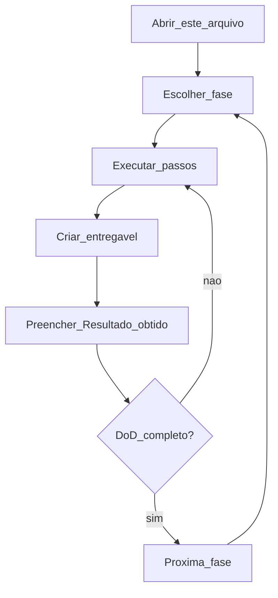
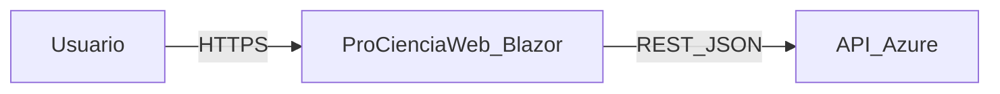

# Plano de execução por fases — ProCienciaWeb

Guia único para documentar o projeto **fase a fase**. Abra este arquivo a cada sessão de trabalho, execute uma fase por vez, preencha **Resultado obtido** e só avance quando o **Critério de pronto (DoD)** estiver completo.

**Branch sugerida:** `feature/docs-mcp-planejamento`  
**Repositório:** `d:\Projetos\ProCiencia\ProCienciaWeb`

---

## Como usar este plano

1. Localize a fase no [Painel de acompanhamento](#painel-de-acompanhamento).
2. Marque **Em andamento** e registre a data de início.
3. Siga **Passos de execução** (ou cole o **Prompt sugerido** no Cursor Agent).
4. Gere o **Entregável** indicado em `docs/` (ou na raiz, quando aplicável).
5. Preencha **Resultado obtido** ao terminar.
6. Confira o **DoD** — todos os itens devem estar marcados `[x]`.
7. Atualize o painel para **Concluída** e passe à próxima fase.



---

## Painel de acompanhamento

Atualize esta tabela ao concluir cada fase.

| Fase | Nome | Status | Data início | Data fim | Entregável |
|------|------|--------|-------------|----------|------------|
| 0 | Preparação (branch + MCPs) | [ ] | | | Branch + MCPs OK |
| 1 | Inventário técnico | [ ] | | | `docs/inventario-tecnico.md` |
| 2 | Arquitetura | [ ] | | | `docs/architecture.md` |
| 3 | Visão do codebase | [ ] | | | `docs/codebase-overview.md` |
| 4 | Setup local | [ ] | | | `docs/setup-local.md` |
| 5 | PRD | [ ] | | | `docs/PRD.md` |
| 6 | TDD | [ ] | | | `docs/TDD.md` |
| 7 | AGENTS.md e regras | [ ] | | | `AGENTS.md` + `.cursor/rules/` |
| 8 | Testes e roadmap | [ ] | | | `docs/roadmap-testes-migracao.md` |

**Legenda de status:** `[ ]` pendente · `[~]` em andamento · `[x]` concluída

---

## Contexto mínimo do projeto

### Stack

| Item | Valor |
|------|--------|
| Runtime | .NET Core 3.1 (`netcoreapp3.1`) — EOL |
| UI | Blazor Server + fallback `_Host` |
| Integração | `ApiService` → `https://apiprociencia.azurewebsites.net` |
| JSON | Newtonsoft.Json 12.0.3 |

### Arquitetura resumida



### Páginas principais

| Rota | Arquivo |
|------|---------|
| `/listaprojetos` | `ProCienciaWeb/Pages/ListaProjetos.razor` |
| `/incluirprojeto` | `ProCienciaWeb/Pages/IncluirProjeto.razor` |
| `/editarprojeto/{id}` | `ProCienciaWeb/Pages/EditarProjeto.razor` |

### Débitos conhecidos (validar nas fases 1–3)

- URL da API hardcoded em `ApiService.cs`
- `HttpClient` estático
- Sem testes automatizados
- `ExcluirProjeto` e `Update` incompletos
- Template Blazor (`WeatherForecast`, `Counter`) ainda no projeto
- Pasta `Controller/` excluída da compilação no `.csproj`

### Estrutura final esperada de `docs/`

```
docs/
├── PLANO-EXECUCAO-POR-FASES.md    ← este arquivo
├── inventario-tecnico.md          ← Fase 1
├── architecture.md                ← Fase 2
├── codebase-overview.md           ← Fase 3
├── setup-local.md                 ← Fase 4
├── PRD.md                         ← Fase 5
├── TDD.md                         ← Fase 6
└── roadmap-testes-migracao.md     ← Fase 8
```

---

## Fase 0 — Preparação (branch + MCPs)

**Status:** [ ] Não iniciada · [ ] Em andamento · [ ] Concluída  
**Prioridade:** P0  
**Entregável:** Branch ativa + MCPs configurados (sem secrets no Git)  
**Skills Cursor:** nenhuma obrigatória

### Objetivo

Garantir ambiente Git e ferramentas MCP antes de gerar documentação.

### Pré-requisitos

- Repositório clonado localmente
- Cursor IDE instalado
- Node.js/npx disponível (para MCPs via npm)

### Passos de execução

1. Confirmar branch de trabalho:
   ```powershell
   cd "d:\Projetos\ProCiencia\ProCienciaWeb"
   git branch
   git checkout feature/docs-mcp-planejamento
   ```
   Se a branch não existir: `git checkout -b feature/docs-mcp-planejamento`
2. Configurar MCPs **globais** em `C:\Users\Elienaldo\.cursor\mcp.json` (ver [Anexo A](#anexo-a--instalação-de-mcps)).
3. Configurar MCPs **.NET do projeto** em `.cursor/mcp.json` na raiz do repo (ver Anexo A).
4. Reiniciar o Cursor ou executar `MCP: View Server Status` — servidores devem aparecer ativos.
5. Validar build:
   ```powershell
   dotnet build ProCienciaWeb.sln
   ```

### Critério de pronto (DoD)

- [ ] Branch `feature/docs-mcp-planejamento` ativa
- [ ] MCP global configurado (pelo menos GitHub ou Context7)
- [ ] MCP projeto configurado (Azure) ou decisão documentada de adiar
- [ ] Nenhum token/secret commitado no repositório
- [ ] `dotnet build` conclui sem erros

### Comandos úteis

```powershell
cd "d:\Projetos\ProCiencia\ProCienciaWeb"
git status
dotnet --version
dotnet build ProCienciaWeb.sln
```

### Prompt sugerido (Cursor Agent)

> Estou na Fase 0 do PLANO-EXECUCAO-POR-FASES.md. Ajude-me a validar a branch Git, revisar se o dotnet build passa e conferir se os MCPs em ~/.cursor/mcp.json e .cursor/mcp.json estão corretos (sem expor secrets). Liste o que falta para marcar a Fase 0 como concluída.

### Resultado obtido (preencher após executar)

- **Data:**
- **O que foi feito:**
- **Arquivos gerados:**
- **Pendências / bloqueios:**
- **Próximo passo:**

---

## Fase 1 — Inventário técnico

**Status:** [ ] Não iniciada · [ ] Em andamento · [ ] Concluída  
**Prioridade:** P0  
**Entregável:** `docs/inventario-tecnico.md`  
**Skills Cursor:** `brainstorming`, subagent `explore`

### Objetivo

Mapear estrutura física do repositório, dependências, entrypoints e rotas — base para arquitetura e PRD.

### Pré-requisitos

- Fase 0 concluída

### Passos de execução

1. Listar solução, projetos e pastas (`ProCienciaWeb.sln`, `ProCienciaWeb/`).
2. Documentar `ProCienciaWeb.csproj`: TargetFramework, PackageReference, itens excluídos (`Controller/`, páginas removidas).
3. Mapear `Program.cs`, `Startup.cs` — serviços registrados e pipeline HTTP.
4. Inventariar todos os `.razor`, `.cs`, models e `ApiService`.
5. Listar rotas `@page` e integrações HTTP (métodos + URLs).
6. Registrar arquivos legado/template (WeatherForecast, Counter, etc.).
7. Criar `docs/inventario-tecnico.md` com tabelas e árvore de diretórios.

### Critério de pronto (DoD)

- [ ] `docs/inventario-tecnico.md` existe e está versionado na branch
- [ ] Todas as pastas relevantes estão listadas
- [ ] Pacotes NuGet documentados com versão
- [ ] Rotas Blazor e endpoints da API externa listados
- [ ] Itens excluídos do `.csproj` explicados

### Comandos úteis

```powershell
cd "d:\Projetos\ProCiencia\ProCienciaWeb"
Get-ChildItem -Recurse -Include *.cs,*.razor,*.csproj | Select-Object FullName
dotnet list ProCienciaWeb\ProCienciaWeb.csproj package
```

### Prompt sugerido (Cursor Agent)

> Fase 1 do PLANO-EXECUCAO-POR-FASES.md. Analise o repositório ProCienciaWeb e gere `docs/inventario-tecnico.md` com: árvore de pastas, dependências do csproj, entrypoints (Program/Startup), serviços DI, todas as rotas @page, métodos do ApiService e arquivos legado. Use tabelas markdown. Não refatore código.

### Conteúdo esperado do entregável

- Árvore de diretórios (nível 2–3)
- Tabela de pacotes NuGet
- Tabela de arquivos `.cs` / `.razor` com responsabilidade breve
- Tabela de rotas e páginas
- Tabela de chamadas HTTP em `ApiService`
- Notas sobre código excluído ou comentado no csproj

### Resultado obtido (preencher após executar)

- **Data:**
- **O que foi feito:**
- **Arquivos gerados:**
- **Pendências / bloqueios:**
- **Próximo passo:**

---

## Fase 2 — Arquitetura

**Status:** [ ] Não iniciada · [ ] Em andamento · [ ] Concluída  
**Prioridade:** P0  
**Entregável:** `docs/architecture.md`  
**Skills Cursor:** `brainstorming`, `canvas` (diagramas)

### Objetivo

Documentar arquitetura com diagramas C4, fluxos de dados e integração com a API Azure.

### Pré-requisitos

- Fase 1 concluída (`docs/inventario-tecnico.md` disponível)

### Passos de execução

1. Ler inventário e código de `Startup.cs`, `ApiService.cs`, páginas principais.
2. Desenhar C4 Nível 1 (contexto) e Nível 2 (containers).
3. Desenhar sequência: listar projetos, incluir projeto, editar projeto.
4. Documentar decisões implícitas (Blazor Server, singleton ApiService, sem auth local).
5. Listar integrações externas e contratos REST consumidos.
6. Criar `docs/architecture.md`.

### Critério de pronto (DoD)

- [ ] `docs/architecture.md` com diagramas (mermaid ou imagens)
- [ ] Fluxo UI → ApiService → API documentado
- [ ] Endpoints REST da API listados com verbos HTTP
- [ ] Limitações e riscos arquiteturais citados (3.1 EOL, HttpClient estático)

### Comandos úteis

```powershell
# Nenhum obrigatório — análise de código
```

### Prompt sugerido (Cursor Agent)

> Fase 2 do PLANO-EXECUCAO-POR-FASES.md. Com base no inventário e no código, crie `docs/architecture.md` com diagramas C4 (contexto e containers), diagramas de sequência para listar/incluir/editar projeto, descrição do pipeline ASP.NET Core e integração com apiprociencia.azurewebsites.net. Inclua riscos arquiteturais.

### Conteúdo esperado do entregável

- Visão geral em 1 parágrafo
- Diagrama C4 contexto
- Diagrama C4 containers
- 2–3 diagramas de sequência
- Tabela de integrações
- Seção de restrições e premissas

### Resultado obtido (preencher após executar)

- **Data:**
- **O que foi feito:**
- **Arquivos gerados:**
- **Pendências / bloqueios:**
- **Próximo passo:**

---

## Fase 3 — Visão do codebase

**Status:** [ ] Não iniciada · [ ] Em andamento · [ ] Concluída  
**Prioridade:** P1  
**Entregável:** `docs/codebase-overview.md`  
**Skills Cursor:** `explore`, `systematic-debugging` (para débitos)

### Objetivo

Explicar responsabilidade de cada módulo, padrões usados e débito técnico priorizado.

### Pré-requisitos

- Fase 2 concluída

### Passos de execução

1. Agrupar código por camada: UI (Pages/Shared), API client, Models, Data legado.
2. Descrever padrões: injeção `@inject`, `ObservableCollection`, async/await.
3. Listar funcionalidades completas vs incompletas (excluir, editar, bind SubArea).
4. Priorizar débitos (P0/P1/P2) com impacto e esforço estimado.
5. Identificar código morto e duplicação (`ProjetoController` vs `ApiService`).
6. Criar `docs/codebase-overview.md`.

### Critério de pronto (DoD)

- [ ] Cada pasta principal tem responsabilidade documentada
- [ ] Lista de débitos com prioridade
- [ ] Funcionalidades incompletas explicitadas
- [ ] Recomendações de limpeza (template, Controller) sem implementar ainda

### Prompt sugerido (Cursor Agent)

> Fase 3 do PLANO-EXECUCAO-POR-FASES.md. Gere `docs/codebase-overview.md` descrevendo módulos, padrões Blazor/API, funcionalidades completas e incompletas, débitos técnicos priorizados e código morto. Referencie arquivos reais do projeto.

### Conteúdo esperado do entregável

- Mapa módulo → responsabilidade
- Tabela de débitos (id, descrição, prioridade, arquivo)
- Tabela funcionalidade × status (ok / parcial / ausente)
- Convenções de código observadas

### Resultado obtido (preencher após executar)

- **Data:**
- **O que foi feito:**
- **Arquivos gerados:**
- **Pendências / bloqueios:**
- **Próximo passo:**

---

## Fase 4 — Setup local

**Status:** [ ] Não iniciada · [ ] Em andamento · [ ] Concluída  
**Prioridade:** P1  
**Entregável:** `docs/setup-local.md`  
**Skills Cursor:** `verification-before-completion`

### Objetivo

Permitir que qualquer desenvolvedor clone, compile e execute o projeto localmente.

### Pré-requisitos

- Fase 1 concluída (inventário de dependências)

### Passos de execução

1. Documentar pré-requisitos: .NET SDK 3.1, VS / VS Code, Cursor opcional.
2. Passo a passo: clone, restore, build, run.
3. Copiar URLs de `launchSettings.json` (5000, 5001, IIS Express).
4. Descrever como validar integração com API Azure (página lista projetos).
5. Seção troubleshooting (SDK errado, certificado HTTPS, API offline).
6. Executar você mesmo o fluxo e corrigir o doc se algo falhar.
7. Criar `docs/setup-local.md`.

### Critério de pronto (DoD)

- [ ] Documento testado por você — build e run funcionam
- [ ] Versão mínima do SDK indicada
- [ ] URLs locais corretas
- [ ] Pelo menos 3 itens de troubleshooting

### Comandos úteis

```powershell
cd "d:\Projetos\ProCiencia\ProCienciaWeb"
dotnet --list-sdks
dotnet restore ProCienciaWeb.sln
dotnet build ProCienciaWeb.sln
dotnet run --project ProCienciaWeb\ProCienciaWeb.csproj
```

### Prompt sugerido (Cursor Agent)

> Fase 4 do PLANO-EXECUCAO-POR-FASES.md. Crie `docs/setup-local.md` com pré-requisitos, comandos para build/run no Windows, URLs do launchSettings e troubleshooting. Valide que os comandos estão corretos para este repositório.

### Conteúdo esperado do entregável

- Pré-requisitos
- Passos numerados clone → run
- Tabela de URLs e perfis de launch
- Como testar manualmente
- Troubleshooting

### Resultado obtido (preencher após executar)

- **Data:**
- **O que foi feito:**
- **Arquivos gerados:**
- **Pendências / bloqueios:**
- **Próximo passo:**

---

## Fase 5 — PRD (Product Requirements Document)

**Status:** [ ] Não iniciada · [ ] Em andamento · [ ] Concluída  
**Prioridade:** P1  
**Entregável:** `docs/PRD.md`  
**Skills Cursor:** `brainstorming`, `writing-plans`

### Objetivo

Documentar visão de produto, usuários, requisitos funcionais/não funcionais e backlog — alinhado ao que o código já faz e ao que falta.

### Pré-requisitos

- Fases 1–3 concluídas (inventário, arquitetura, codebase)

### Passos de execução

1. Definir visão do Pró Ciência / ProCienciaWeb em 2–3 frases.
2. Identificar personas (ex.: pesquisador, gestor, administrador).
3. Listar funcionalidades **atuais** (listar, incluir, editar parcial, filtrar).
4. Listar funcionalidades **desejadas** (excluir, editar completo, validações).
5. Escrever RF (requisitos funcionais) numerados.
6. Escrever RNF (performance, disponibilidade API, compatibilidade browser).
7. Montar backlog priorizado (Must / Should / Could).
8. Criar `docs/PRD.md`.

### Critério de pronto (DoD)

- [ ] Visão e objetivos definidos
- [ ] Pelo menos 2 personas
- [ ] RF e RNF numerados
- [ ] Backlog com prioridade
- [ ] Alinhamento explícito com rotas/páginas existentes

### Prompt sugerido (Cursor Agent)

> Fase 5 do PLANO-EXECUCAO-POR-FASES.md. Com base na análise do ProCienciaWeb, redija `docs/PRD.md`: visão, personas, requisitos funcionais e não funcionais, funcionalidades atuais vs planejadas, backlog priorizado. Escreva em português, tom profissional.

### Conteúdo esperado do entregável

- Visão e escopo
- Personas
- Jornadas ou casos de uso principais
- RF-001, RF-002…
- RNF-001, RNF-002…
- Backlog (tabela: id, item, prioridade, status)

### Resultado obtido (preencher após executar)

- **Data:**
- **O que foi feito:**
- **Arquivos gerados:**
- **Pendências / bloqueios:**
- **Próximo passo:**

---

## Fase 6 — TDD (Technical Design Document)

**Status:** [ ] Não iniciada · [ ] Em andamento · [ ] Concluída  
**Prioridade:** P1  
**Entregável:** `docs/TDD.md`  
**Skills Cursor:** `writing-plans`, Context7 MCP (docs .NET)

### Objetivo

Documentar decisões técnicas, contratos de API, modelos de dados, segurança e deploy.

### Pré-requisitos

- Fases 2 e 5 concluídas (arquitetura + PRD)

### Passos de execução

1. Registrar stack e versões (3.1, Blazor Server, Newtonsoft).
2. Documentar contrato REST consumido (rotas, payloads, models C#).
3. ADRs curtas: por que ApiService singleton, por que API externa, por que não EF local.
4. Segurança: HTTPS, CORS (se aplicável), ausência de auth no front.
5. Configuração: o que deveria ir em appsettings (UrlServico).
6. Deploy: Azure App Service da API; front como publicação ASP.NET.
7. Criar `docs/TDD.md`.

### Critério de pronto (DoD)

- [ ] Stack e dependências documentadas
- [ ] Contrato API com exemplos de models (`Projeto`, `Area`, `SubArea`)
- [ ] Pelo menos 3 ADRs
- [ ] Seção segurança e configuração
- [ ] Nota sobre migração .NET 8 como recomendação futura

### Prompt sugerido (Cursor Agent)

> Fase 6 do PLANO-EXECUCAO-POR-FASES.md. Crie `docs/TDD.md` com stack, contratos da API Azure, modelos C#, ADRs, segurança, configuração recomendada (appsettings) e notas de deploy. Referencie ApiService e Models reais.

### Conteúdo esperado do entregável

- Stack técnica
- Diagrama ou tabela de contratos API
- Modelos de dados
- ADRs (título, contexto, decisão, consequências)
- Segurança e configuração
- Deploy e ambientes

### Resultado obtido (preencher após executar)

- **Data:**
- **O que foi feito:**
- **Arquivos gerados:**
- **Pendências / bloqueios:**
- **Próximo passo:**

---

## Fase 7 — AGENTS.md e regras Cursor

**Status:** [ ] Não iniciada · [ ] Em andamento · [ ] Concluída  
**Prioridade:** P2  
**Entregável:** `AGENTS.md` + `.cursor/rules/*.mdc`  
**Skills Cursor:** `create-rule`, `create-skill`

### Objetivo

Orientar agentes de IA a trabalhar no repositório com padrões consistentes.

### Pré-requisitos

- Fases 1–6 concluídas (documentação base existe)

### Passos de execução

1. Criar `AGENTS.md` na raiz: visão, links para `docs/`, comandos build, convenções.
2. Definir regra para `**/*.cs` (ApiService, async, não hardcodar URLs).
3. Definir regra para `**/*.razor` (injeção, padrões Blazor 3.1).
4. Opcional: skills `.cursor/skills/procencia-doc` e `procencia-dotnet`.
5. Testar pedindo ao agente uma tarefa pequena e verificar se segue as regras.

### Critério de pronto (DoD)

- [ ] `AGENTS.md` na raiz com links para todos os docs
- [ ] Pelo menos 2 arquivos `.cursor/rules/*.mdc`
- [ ] Comandos `dotnet build` / `dotnet run` documentados no AGENTS.md
- [ ] Sem secrets nas regras

### Prompt sugerido (Cursor Agent)

> Fase 7 do PLANO-EXECUCAO-POR-FASES.md. Crie `AGENTS.md` e regras em `.cursor/rules/` para C# e Razor deste projeto Blazor 3.1. Inclua links para docs/, convenções de ApiService e proibição de commitar secrets. Use create-rule.

### Conteúdo esperado do entregável

- `AGENTS.md`: contexto, docs, comandos, do/don't
- `.cursor/rules/dotnet.mdc` (ou similar)
- `.cursor/rules/blazor.mdc` (ou similar)

### Resultado obtido (preencher após executar)

- **Data:**
- **O que foi feito:**
- **Arquivos gerados:**
- **Pendências / bloqueios:**
- **Próximo passo:**

---

## Fase 8 — Testes e roadmap de evolução

**Status:** [ ] Não iniciada · [ ] Em andamento · [ ] Concluída  
**Prioridade:** P2  
**Entregável:** `docs/roadmap-testes-migracao.md`  
**Skills Cursor:** `test-driven-development`, `verification-before-completion`

### Objetivo

Planejar testes (unitários e E2E) e roadmap de modernização (.NET 8, HttpClient, etc.) — sem implementar tudo nesta fase.

### Pré-requisitos

- Fases 1–7 concluídas

### Passos de execução

1. Propor estrutura de projeto de testes xUnit para `ApiService` (mocks HTTP).
2. Propor cenários Playwright E2E (lista, incluir, navegação).
3. Priorizar roadmap: migração 3.1→8, appsettings, IHttpClientFactory, completar CRUD.
4. Estimar esforço (S/M/L) por item.
5. Definir ordem de execução pós-documentação.
6. Criar `docs/roadmap-testes-migracao.md`.

### Critério de pronto (DoD)

- [ ] Estratégia de testes unitários descrita
- [ ] Cenários E2E listados
- [ ] Roadmap com pelo menos 5 itens priorizados
- [ ] Riscos da migração .NET 8 mencionados

### Prompt sugerido (Cursor Agent)

> Fase 8 do PLANO-EXECUCAO-POR-FASES.md. Crie `docs/roadmap-testes-migracao.md` com plano de testes xUnit para ApiService, cenários Playwright, roadmap de migração para .NET 8 e melhorias técnicas priorizadas. Não implemente código ainda — apenas o plano.

### Conteúdo esperado do entregável

- Pirâmide de testes (visão)
- Casos de teste unitário (lista)
- Casos E2E (lista)
- Roadmap tabela (item, prioridade, esforço, dependências)
- Cronograma sugerido (opcional)

### Resultado obtido (preencher após executar)

- **Data:**
- **O que foi feito:**
- **Arquivos gerados:**
- **Pendências / bloqueios:**
- **Próximo passo:**

---

## Anexo A — Instalação de MCPs

### Onde configurar

| Escopo | Caminho Windows | Conteúdo |
|--------|-----------------|----------|
| Global | `C:\Users\Elienaldo\.cursor\mcp.json` | GitHub, Context7, Playwright |
| Projeto (.NET) | `.cursor/mcp.json` na raiz do repo | Azure MCP, SQL Server (opcional) |

Após editar: **reinicie o Cursor** ou `MCP: View Server Status`.

### Exemplo — global (`~/.cursor/mcp.json`)

```json
{
  "mcpServers": {
    "github": {
      "url": "https://api.githubcopilot.com/mcp/",
      "headers": {
        "Authorization": "Bearer SEU_GITHUB_PAT"
      }
    },
    "playwright": {
      "command": "npx",
      "args": ["-y", "@playwright/mcp@latest"]
    }
  }
}
```

Guia GitHub: https://github.com/github/github-mcp-server/blob/main/docs/installation-guides/install-cursor.md

Context7: registrar em https://context7.com e adicionar servidor conforme documentação do provedor.

### Exemplo — projeto (`.cursor/mcp.json`)

```json
{
  "mcpServers": {
    "Azure MCP Server": {
      "command": "npx",
      "args": ["-y", "@azure/mcp@latest", "server", "start"]
    },
    "mssql": {
      "command": "npx",
      "args": ["-y", "@modelcontextprotocol/server-mssql"],
      "env": {
        "MSSQL_CONNECTION_STRING": "${env:MSSQL_CONNECTION_STRING}"
      }
    }
  }
}
```

Documentação Azure: https://learn.microsoft.com/en-us/azure/developer/azure-mcp-server/get-started/tools/cursor

**Nunca** commitar PAT, connection strings ou API keys.

### MCPs já no Cursor (sem config)

- `cursor-ide-browser` — testar UI local
- `cursor-app-control` — controle do IDE

---

## Anexo B — Skills Cursor

### Já disponíveis (não instalar)

| Origem | Skills |
|--------|--------|
| `~/.cursor/skills-cursor/` | `create-rule`, `create-skill`, `canvas` |
| Superpowers | `brainstorming`, `writing-plans`, `systematic-debugging`, `verification-before-completion` |

**Uso:** peça na conversa, ex.: *"use brainstorming"* ou *"siga writing-plans"*.

### Recomendadas para criar no projeto (Fase 7+)

| Skill | Caminho |
|-------|---------|
| `procencia-doc` | `.cursor/skills/procencia-doc/SKILL.md` |
| `procencia-dotnet` | `.cursor/skills/procencia-dotnet/SKILL.md` |

Não criar skills em `~/.cursor/skills-cursor/` (reservado ao Cursor).

### Skills por fase

| Fases | Skills |
|-------|--------|
| 0 | — |
| 1–3 | `brainstorming`, `explore`, `canvas` |
| 4–6 | `writing-plans`, Context7 |
| 7 | `create-rule`, `create-skill` |
| 8 | `test-driven-development`, `verification-before-completion` |

---

## Anexo C — Riscos e recomendações

| Risco | Impacto | Ação recomendada |
|-------|---------|------------------|
| .NET Core 3.1 EOL | Segurança | Roadmap migração .NET 8 (Fase 8) |
| URL API hardcoded | Ambientes | `appsettings.json` + options pattern |
| HttpClient estático | Estabilidade | `IHttpClientFactory` na migração |
| Sem testes | Regressões | xUnit + Playwright (Fase 8) |
| CRUD incompleto | Produto | Backlog PRD + implementação futura |
| Secrets no Git | Segurança | `.gitignore`, `${env:VAR}` nos MCPs |

---

## Checklist final (antes do merge em `master`)

- [ ] Fases 0–8 marcadas como concluídas no [Painel](#painel-de-acompanhamento)
- [ ] Todos os entregáveis em `docs/` existem
- [ ] `AGENTS.md` criado (Fase 7)
- [ ] `dotnet build ProCienciaWeb.sln` sem erros
- [ ] Revisão humana dos documentos
- [ ] Nenhum secret no repositório
- [ ] Commit na branch `feature/docs-mcp-planejamento`
- [ ] PR aberto para `master` (quando estiver pronto)

```powershell
cd "d:\Projetos\ProCiencia\ProCienciaWeb"
git status
git add docs/
git commit -m "docs: adiciona plano de execução por fases e entregáveis da documentação técnica"
```

---

## Referências rápidas

| Recurso | Caminho / URL |
|---------|----------------|
| Solução | `ProCienciaWeb.sln` |
| Projeto web | `ProCienciaWeb/ProCienciaWeb.csproj` |
| API client | `ProCienciaWeb/API/ApiService.cs` |
| Startup | `ProCienciaWeb/Startup.cs` |
| API externa | `https://apiprociencia.azurewebsites.net` |
| Cursor MCP | https://cursor.com/docs/mcp |
