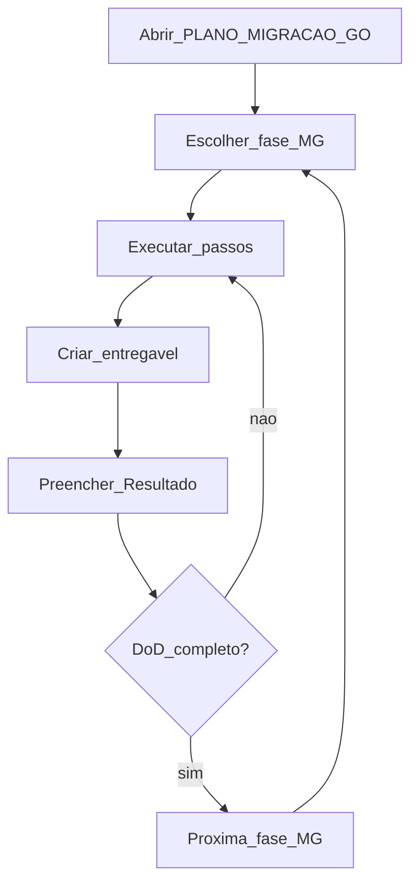
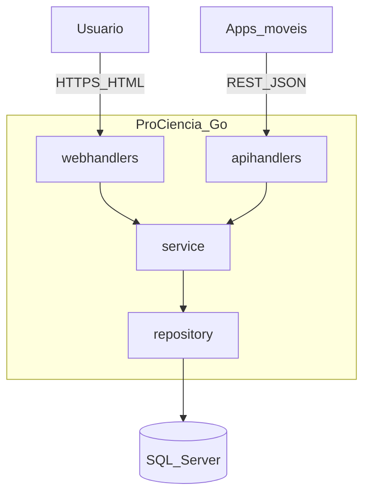

# Plano de migração para Go — ProCienciaWeb

Guia de execução **fase a fase** para migrar o ecossistema Pró Ciência de **.NET Blazor Server + API C#** para **Go** com **arquitetura modular simples** (monólito modular: API REST + web SSR no mesmo repositório).

**Execute uma fase MG por sessão.** Preencha **Resultado obtido** e marque o **DoD** antes de avançar.

**Repositório:** `d:\Projetos\ProCiencia\ProCienciaWeb`  
**Branch sugerida:** `feature/migracao-go`  
**Plano .NET anterior:** [PLANO-EXECUCAO-POR-FASES.md](./PLANO-EXECUCAO-POR-FASES.md) — **PAUSADO** (Fases 0–5 concluídas; Fases 6–8 não executar)

---

## Documentação de referência (já existente)

| Documento | Uso na migração |
|-----------|-----------------|
| [PRD.md](./PRD.md) | Requisitos RF/RNF, backlog BL-001…030, critérios de aceite MVP |
| [architecture.md](./architecture.md) | Contratos REST atuais, diagramas C4, sequências |
| [inventario-tecnico.md](./inventario-tecnico.md) | Rotas Blazor, `ApiService`, models C# |
| [codebase-overview.md](./codebase-overview.md) | Débitos DT-01…15, status funcionalidades |
| [setup-local.md](./setup-local.md) | Referência de ambiente .NET (legado) |

---

## Como usar este plano

1. Localize a fase no [Painel de acompanhamento](#painel-de-acompanhamento).
2. Marque **Em andamento** e registre a data de início.
3. Siga **Passos de execução** (ou cole o **Prompt sugerido** no Cursor Agent).
4. Gere o **Entregável** indicado.
5. Preencha **Resultado obtido** ao terminar.
6. Confira o **DoD** — todos os itens devem estar `[x]`.
7. Atualize o painel para **Concluída** e passe à próxima fase **somente quando você autorizar**.



---

## Painel de acompanhamento

| Fase | Nome | Status | Data início | Data fim | Entregável |
|------|------|--------|-------------|----------|------------|
| MG-0 | Pausa .NET + setup agente | [x] | 2026-05-27 | 2026-05-27 | `AGENTS.md` + banner plano antigo |
| MG-1 | Descoberta API legada | [x] | 2026-05-30 | 2026-05-30 | `docs/go/inventario-api-legado.md` |
| MG-2 | Arquitetura Go | [x] | 2026-05-30 | 2026-05-30 | `docs/go/architecture.md` + `docs/go/adr/` |
| MG-3 | Scaffold Go | [ ] | | | `go.mod`, `cmd/prociencia/`, healthcheck |
| MG-4 | API REST Go | [ ] | | | `internal/apihandlers` + `repository` |
| MG-5 | Web SSR Go | [ ] | | | `web/templates`, `internal/webhandlers` |
| MG-6 | Qualidade e testes | [ ] | | | testes Go + Playwright |
| MG-7 | Deploy e cutover | [ ] | | | `docs/go/deploy.md`, `legacy/dotnet/` |
| MG-8 | Encerramento documentação | [ ] | | | PRD v2, README |

**Legenda:** `[ ]` pendente · `[~]` em andamento · `[x]` concluída

---

## Contexto da migração

### Decisões de produto e arquitetura

| Decisão | Escolha |
|---------|---------|
| Linguagem | **Go 1.22+** |
| UI | **HTML no servidor** (`html/template` + `embed`) — padrão da comunidade Go para apps web sem SPA |
| Router HTTP | **chi** (`github.com/go-chi/chi/v5`) |
| Backend | **Reescrever API** (substituir `ServicoProCiencia` / Azure) mantendo **contrato REST** para apps móveis |
| Organização | **Monólito modular** (`cmd/` + `internal/`) |
| Código .NET | Congelar em `legacy/dotnet/` após MG-7; não evoluir Blazor |

### Arquitetura alvo



### Mapeamento de rotas (paridade)

| Rota atual (.NET) | Destino Go |
|-------------------|------------|
| `/` | `GET /` — home |
| `/listaprojetos` | `GET /listaprojetos` |
| `/incluirprojeto` | `GET` + `POST /incluirprojeto` |
| `/editarprojeto/{id}` | `GET` + `POST /editarprojeto/{id}` |
| `GET/POST/PUT/DELETE /api/Projetos...` | `internal/apihandlers` |
| `GET /api/Areas`, `/api/SubAreas`, `/api/Instituicoes` | `internal/apihandlers` |

### Critérios de aceite herdados do PRD (implementar até MG-5)

- BL-001 … BL-005 (CRUD Must): subárea vinculada, update, delete, validação POST, confirmação de exclusão
- RF-001 … RF-013 conforme [PRD.md](./PRD.md) seção 6

### Estrutura final esperada do repositório

```
/
├── AGENTS.md
├── go.mod
├── cmd/prociencia/main.go
├── internal/
│   ├── config/
│   ├── domain/
│   ├── repository/
│   ├── service/
│   ├── apihandlers/
│   └── webhandlers/
├── web/templates/
├── web/static/
├── migrations/
├── docs/
│   ├── PLANO-MIGRACAO-GO.md    ← este arquivo
│   ├── go/
│   │   ├── inventario-api-legado.md
│   │   ├── architecture.md
│   │   ├── adr/
│   │   └── deploy.md
│   └── ... (docs legado .NET)
├── e2e/                         ← MG-6
└── legacy/dotnet/               ← MG-7 (ProCienciaWeb.sln atual)
```

---

## MG-0 — Pausa .NET + setup agente

**Status:** [ ] Não iniciada · [ ] Em andamento · [x] Concluída  
**Prioridade:** P0  
**Entregável:** [`AGENTS.md`](../../AGENTS.md) (raiz do repo) + banner no plano .NET + [`docs/go/MG-0-RESULTADO.md`](./go/MG-0-RESULTADO.md)  
**Skills:** opcional — ver passo 5 e [Anexo A](#anexo-a--mcps-e-skills) (instalação local; Node ≥ 22)

### Objetivo

Formalizar a pausa do plano .NET, criar guia curto para o agente Cursor (stack Go) e preparar branch de migração **sem alterar código de produção Go ainda**.

### Pré-requisitos

- Fases 0–5 do [PLANO-EXECUCAO-POR-FASES.md](./PLANO-EXECUCAO-POR-FASES.md) concluídas
- Go instalado localmente (`go version` ≥ 1.22)
- Decisão de migrar API + web registrada neste plano

### Passos de execução

1. Inserir banner **PAUSADO** no topo de `docs/PLANO-EXECUCAO-POR-FASES.md` com link para este arquivo.
2. Criar branch:
   ```powershell
   cd "d:\Projetos\ProCiencia\ProCienciaWeb"
   git checkout -b feature/migracao-go
   ```
3. Criar `AGENTS.md` na raiz do repositório (conteúdo: stack, pastas, comandos, MCPs, skills — ver [Anexo B](#anexo-b--conteúdo-referência-agentsmd)).
4. Revisar MCPs globais e de projeto ([Anexo A](#anexo-a--mcps-e-skills)).
5. Instalar skills recomendadas do Tech Leads Club (opcional, local) — ver [Anexo A](#anexo-a--mcps-e-skills):
   ```powershell
   # Desenvolvimento e qualidade
   npx @tech-leads-club/agent-skills install --skill coding-guidelines
   npx @tech-leads-club/agent-skills install --skill codenavi
   npx @tech-leads-club/agent-skills install --skill best-practices
   npx @tech-leads-club/agent-skills install --skill chrome-devtools
   npx @tech-leads-club/agent-skills install --skill docs-writer
   # Arquitetura e migração (prioridade para MG-1 … MG-2)
   npx @tech-leads-club/agent-skills install --skill legacy-migration-planner
   npx @tech-leads-club/agent-skills install --skill modular-decomposition
   npx @tech-leads-club/agent-skills install --skill modular-design-principles
   npx @tech-leads-club/agent-skills install --skill domain-analysis
   npx @tech-leads-club/agent-skills install --skill decomposition-planning-roadmap
   npx @tech-leads-club/agent-skills install --skill the-fool
   # Design técnico (TDD e ADR — MG-2)
   npx @tech-leads-club/agent-skills install --skill technical-design-doc-creator
   npx @tech-leads-club/agent-skills install --skill create-adr
   ```
6. Documentar em `docs/go/MG-0-RESULTADO.md` o que foi configurado (sem secrets).

### Critério de pronto (DoD)

- [x] Banner de pausa no plano .NET
- [x] Branch `feature/migracao-go` criada
- [x] `AGENTS.md` na raiz, versionado
- [x] MCPs documentados (GitHub, Playwright, Azure; SQL adiado até MG-1)
- [x] Nenhum código Go de aplicação commitado nesta fase

### Prompt sugerido (Cursor Agent)

> Fase MG-0 do PLANO-MIGRACAO-GO.md. Adicione banner de pausa em PLANO-EXECUCAO-POR-FASES.md, crie AGENTS.md curto na raiz conforme Anexo B, e docs/go/MG-0-RESULTADO.md. Não crie go.mod nem mova o projeto .NET ainda.

### Resultado obtido (preencher após executar)

- **Data:** 2026-05-27 (reexecução MG-0 concluída)
- **O que foi feito:** Banner PAUSADO no plano .NET; `AGENTS.md` na raiz (stack, MCPs, skills v1.1); branch `feature/migracao-go`; MCPs revisados; `docs/go/MG-0-RESULTADO.md` atualizado. Sem `go.mod` nem movimentação do .NET.
- **Arquivos gerados:** `AGENTS.md`, `ProCienciaWeb/docs/go/MG-0-RESULTADO.md`; alterados `PLANO-EXECUCAO-POR-FASES.md`, `PLANO-MIGRACAO-GO.md`
- **Pendências / bloqueios:** Instalação Tech Leads Club via `npx` — executar localmente com Node ≥ 22 (ver MG-0-RESULTADO.md). MSSQL MCP na MG-1.
- **Próximo passo:** MG-1

---

## MG-1 — Descoberta API legada (ServicoProCiencia)

**Status:** [ ] Não iniciada · [ ] Em andamento · [x] Concluída  
**Prioridade:** P0  
**Entregável:** `docs/go/inventario-api-legado.md`  
**Skills:** `codenavi`, `legacy-migration-planner`, `domain-analysis`, `modular-decomposition` (Patterns 1–4 no legado .NET) · **MCP:** GitHub, SQL Server (se DB local)

### Objetivo

Mapear o backend C# atual (`ServicoProCiencia`) — endpoints, models, autenticação, schema de banco — para portar com paridade em Go.

### Pré-requisitos

- MG-0 concluída
- Acesso ao repositório `ServicoProCiencia` (clone local ou GitHub via MCP)
- Connection string de desenvolvimento (`MSSQL_CONNECTION_STRING`) se houver banco

### Passos de execução

1. Clonar/abrir `ServicoProCiencia` (GitHub: `Elienaldo/ServicoProCiencia`).
2. Listar controllers / rotas `/api/*` e comparar com [architecture.md §9](./architecture.md).
3. Documentar entidades: `Projeto`, `Area`, `SubArea`, `Instituicao` — propriedades, FKs, validações.
4. Identificar tecnologia de persistência (EF Core, SQL Server, migrations).
5. Exportar ou descrever schema (tabelas, colunas, índices).
6. Registrar autenticação/autorização na API (se existir).
7. Listar diferenças entre API Azure (`apiprociencia.azurewebsites.net`) e código local.
8. Criar `docs/go/inventario-api-legado.md` com tabelas.

### Critério de pronto (DoD)

- [x] Todos os endpoints `/api/Projetos`, `/api/Areas`, `/api/SubAreas`, `/api/Instituicoes` documentados (verbo, path, body, response)
- [x] Schema de banco descrito ou diagrama ER
- [x] Dependências NuGet / versão .NET da API legada registradas
- [x] Riscos de paridade (campos só na API, behaviors especiais) listados
- [x] MCP SQL configurado **ou** decisão de usar apenas scripts manuais documentada

### Comandos úteis

```powershell
# Exemplo — ajustar caminho do clone
cd "d:\Projetos\ProCiencia\ServicoProCiencia"
Get-ChildItem -Recurse -Include *Controller*.cs | Select-Object FullName
```

### Prompt sugerido (Cursor Agent)

> Fase MG-1 do PLANO-MIGRACAO-GO.md. Analise o repositório ServicoProCiencia e gere docs/go/inventario-api-legado.md: rotas REST, models, EF/schema SQL, auth e gaps vs architecture.md do ProCienciaWeb. Não implemente Go ainda.

### Conteúdo esperado do entregável

- Tabela endpoints REST
- Tabela entidades / colunas
- Diagrama ER (mermaid opcional)
- Notas para apps móveis (contrato estável)

### Resultado obtido (preencher após executar)

- **Data:** 2026-05-30
- **O que foi feito:** Análise do repositório `Elienaldo/ServicoProCiencia` via GitHub MCP; validação do OpenAPI em Azure; comparação com `architecture.md` e `ApiService`; schema inferido + diagrama ER; riscos P1–P9; MCP MSSQL documentado em `.cursor/mcp.json` (ativação depende de env var).
- **Arquivos gerados:** `docs/go/inventario-api-legado.md`; alterados `PLANO-MIGRACAO-GO.md`, `AGENTS.md`, `.cursor/mcp.json`
- **Pendências / bloqueios:** API Azure retorna **500** em `/api/*` (provável SQL no App Service); schema de tabelas não confirmado em DB live — export DDL na MG-4 com `MSSQL_CONNECTION_STRING` local.
- **Próximo passo:** MG-2

---

## MG-2 — Arquitetura Go

**Status:** [ ] Não iniciada · [ ] Em andamento · [x] Concluída  
**Prioridade:** P0  
**Entregável:** `docs/go/architecture.md` (TDD) + `docs/go/adr/` (mín. 3 ADRs)  
**Skills:** `brainstorming`, `writing-plans`, `modular-design-principles`, `modular-decomposition` (Patterns 5 + DDD), `domain-analysis`, `decomposition-planning-roadmap`, `legacy-migration-planner`, `technical-design-doc-creator` (TDD principal), `create-adr`, `the-fool` (stress-test antes de congelar), `docs-writer` (revisão markdown final)

### Objetivo

Congelar decisões de arquitetura modular, contratos entre camadas, configuração e estratégia de compatibilidade com clientes móveis.

### Pré-requisitos

- MG-1 concluída
- [PRD.md](./PRD.md) e [inventario-api-legado.md](./go/inventario-api-legado.md) disponíveis

### Passos de execução

1. Definir nome do módulo Go (`go.mod`, ex.: `github.com/Elienaldo/prociencia`).
2. Documentar responsabilidade de cada pacote em `internal/`.
3. Definir se web chama API via HTTP interno ou direto ao `service` (recomendado: **in-process** no monolith).
4. Registrar ADRs em `docs/go/adr/` com `create-adr` (mín. 3): chi vs stdlib, driver SQL Server, migrações (goose/golang-migrate), web in-process (se aplicável).
5. Mapear RF/BL do PRD para pacotes Go.
6. Definir variáveis de ambiente (`DATABASE_URL`, `HTTP_ADDR`, `LOG_LEVEL`).
7. Redigir `docs/go/architecture.md` como **TDD** com `technical-design-doc-creator` (seções obrigatórias + Migration Plan + Rollback para produção) e diagramas C4.
8. Revisar tom/estrutura markdown com `docs-writer` (não substitui TDD/ADR).

### Critério de pronto (DoD)

- [x] Diagrama de contexto e containers (Go)
- [x] Tabela pacote → responsabilidade
- [x] Contrato REST `/api/*` congelado (breaking changes exigem versão)
- [x] ADRs em arquivos separados em `docs/go/adr/` (mínimo 3)
- [x] `architecture.md` segue estrutura TDD (contexto, escopo, solução, riscos, plano; rollback/migração)
- [x] Estratégia de migração de dados (se necessário) descrita

### Prompt sugerido (Cursor Agent)

> Fase MG-2 do PLANO-MIGRACAO-GO.md. Com base em PRD.md, architecture.md legado e docs/go/inventario-api-legado.md: use `technical-design-doc-creator` para redigir `docs/go/architecture.md` (TDD da migração Go); use `create-adr` para ADRs em `docs/go/adr/`; valide com `the-fool`; revise markdown com `docs-writer`. Não gere código ainda.

### Resultado obtido (preencher após executar)

- **Data:** 2026-05-30
- **O que foi feito:** TDD `architecture.md`; 4 ADRs (chi, go-mssqldb, golang-migrate, web in-process); módulo `github.com/Elienaldo/prociencia`; mapeamento RF/BL; pré-mortem no TDD. Detalhes em [`MG-2-RESULTADO.md`](./go/MG-2-RESULTADO.md).
- **Arquivos gerados:** `docs/go/architecture.md`, `docs/go/adr/*`, `docs/go/MG-2-RESULTADO.md`
- **Pendências / bloqueios:** DDL live na MG-4
- **Próximo passo:** MG-3

---

## MG-3 — Scaffold Go

**Status:** [ ] Não iniciada · [ ] Em andamento · [ ] Concluída  
**Prioridade:** P0  
**Entregável:** módulo Go compilável com healthcheck  
**Skills:** `coding-guidelines`, `modular-design-principles`, `verification-before-completion`

### Objetivo

Criar esqueleto do projeto Go sem lógica de negócio completa — apenas wiring, config e endpoint de saúde.

### Pré-requisitos

- MG-2 concluída
- Go 1.22+ instalado

### Passos de execução

1. Na raiz do repositório: `go mod init <module path>` conforme architecture.md.
2. Criar `cmd/prociencia/main.go` — carrega config, monta router chi, inicia servidor.
3. Criar pacotes vazios: `internal/config`, `internal/domain`, `internal/service`, `internal/repository`, `internal/apihandlers`, `internal/webhandlers`.
4. Implementar `GET /health` → `200 OK` JSON `{"status":"ok"}`.
5. Criar `web/static/` e `web/templates/` com placeholder.
6. Adicionar `.gitignore` entries para binários Go (`/bin/`, `*.exe`).
7. Validar:
   ```powershell
   go build -o bin/prociencia.exe ./cmd/prociencia
   go test ./...
   ```
8. **Não mover** .NET para `legacy/dotnet/` nesta fase (reservado para MG-7).

### Critério de pronto (DoD)

- [ ] `go.mod` e `go.sum` versionados
- [ ] `go build ./cmd/prociencia` sem erros
- [ ] `GET /health` responde localmente
- [ ] Estrutura de pastas conforme seção [Estrutura final](#estrutura-final-esperada-do-repositório)
- [ ] CI mínimo documentado (comando `go test ./...`) em architecture.md ou README

### Prompt sugerido (Cursor Agent)

> Fase MG-3 do PLANO-MIGRACAO-GO.md. Crie scaffold Go: go.mod, cmd/prociencia, pacotes internal vazios, chi router, GET /health. Não mova o projeto .NET. Siga docs/go/architecture.md.

### Resultado obtido (preencher após executar)

- **Data:**
- **O que foi feito:**
- **Arquivos gerados:**
- **Pendências / bloqueios:**
- **Próximo passo:** MG-4

---

## MG-4 — API REST Go

**Status:** [ ] Não iniciada · [ ] Em andamento · [ ] Concluída  
**Prioridade:** P0  
**Entregável:** API funcional com paridade ao contrato documentado  
**Skills:** `coding-guidelines`, `tactical-ddd`, `modular-design-principles`, `test-driven-development`, `systematic-debugging` · **MCP:** SQL Server, GitHub

### Objetivo

Implementar camada de persistência e handlers REST `/api/*` equivalentes ao `ServicoProCiencia` / Azure.

### Pré-requisitos

- MG-3 concluída
- Banco de desenvolvimento acessível
- `docs/go/inventario-api-legado.md` como especificação

### Passos de execução

1. Implementar `internal/domain` (structs Projeto, Area, SubArea, Instituicao).
2. Implementar `internal/repository` com `database/sql` + driver `go-mssqldb` (ou driver definido na MG-2).
3. Criar scripts em `migrations/` (schema + seed mínimo se necessário).
4. Implementar `internal/service` — regras de validação de negócio.
5. Implementar `internal/apihandlers`:
   - `GET/POST /api/Projetos`
   - `GET/PUT/PATCH/DELETE /api/Projetos/{id}`
   - `GET /api/Areas`, `/api/SubAreas`, `/api/Instituicoes`
6. JSON encoding com `encoding/json` (tags alinhadas ao contrato legado).
7. Tratamento de erros HTTP padronizado (4xx/5xx JSON).
8. Testes: `repository` (integração com DB de teste ou docker) + `apihandlers` com `httptest`.
9. Validar paridade manualmente contra lista em inventario-api-legado.

### Critério de pronto (DoD)

- [ ] CRUD `/api/Projetos` completo e testado
- [ ] Endpoints de lookup (Areas, SubAreas, Instituicoes) funcionais
- [ ] `go test ./internal/...` verde
- [ ] Payload JSON compatível com models C# documentados
- [ ] Logs estruturados (`slog`) em erros de DB/API

### Prompt sugerido (Cursor Agent)

> Fase MG-4 do PLANO-MIGRACAO-GO.md. Implemente internal/domain, repository, service e apihandlers com paridade ao inventario-api-legado.md. Inclua migrations e testes httptest. Não implemente templates web ainda.

### Resultado obtido (preencher após executar)

- **Data:**
- **O que foi feito:**
- **Arquivos gerados:**
- **Pendências / bloqueios:**
- **Próximo passo:** MG-5

---

## MG-5 — Web SSR Go

**Status:** [ ] Não iniciada · [ ] Em andamento · [ ] Concluída  
**Prioridade:** P0  
**Entregável:** UI HTML equivalente às páginas Blazor  
**Skills:** `coding-guidelines`, `best-practices`, `frontend-blueprint`, `chrome-devtools`

### Objetivo

Substituir `ListaProjetos`, `IncluirProjeto` e `EditarProjeto` por handlers Go + templates, consumindo `service` in-process.

### Pré-requisitos

- MG-4 concluída (API/service estável)

### Passos de execução

1. Portar assets de `wwwroot` (Bootstrap, CSS) para `web/static/` com `embed`.
2. Criar layout base `web/templates/layout.html` e partials (menu: Home, Projetos).
3. Implementar `internal/webhandlers`:
   - `GET /` — home
   - `GET /listaprojetos` — tabela + filtro por subárea (server-side)
   - `GET/POST /incluirprojeto` — formulário + create
   - `GET/POST /editarprojeto/{id}` — formulário + update
   - `POST` delete com confirmação (ou modal) na listagem
4. Implementar itens **BL-001 … BL-005** do [PRD.md](./PRD.md):
   - Select subárea com valor correto (`SubAreaId`)
   - Update e delete funcionais
   - Validação de POST antes de redirect
   - Confirmação antes de excluir
5. Mensagens de erro/sucesso na UI (RF-012 parcial).
6. Validar fluxos manualmente no browser.

### Critério de pronto (DoD)

- [ ] Rotas web listadas em [Mapeamento de rotas](#mapeamento-de-rotas-paridade) funcionais
- [ ] BL-001 … BL-005 implementados
- [ ] Interface em português, Bootstrap legível
- [ ] Sem dependência de Blazor/SignalR
- [ ] `go build` e smoke manual OK

### Prompt sugerido (Cursor Agent)

> Fase MG-5 do PLANO-MIGRACAO-GO.md. Implemente webhandlers e templates HTML para /, /listaprojetos, /incluirprojeto, /editarprojeto/{id}. Atenda BL-001 a BL-005 do PRD.md. Reutilize service in-process.

### Resultado obtido (preencher após executar)

- **Data:**
- **O que foi feito:**
- **Arquivos gerados:**
- **Pendências / bloqueios:**
- **Próximo passo:** MG-6

---

## MG-6 — Qualidade e testes

**Status:** [ ] Não iniciada · [ ] Em andamento · [ ] Concluída  
**Prioridade:** P1  
**Entregável:** suíte de testes + E2E Playwright  
**Skills:** `test-driven-development`, `verification-before-completion` · **MCP:** Playwright

### Objetivo

Garantir regressão automatizada para API e fluxos web críticos.

### Pré-requisitos

- MG-5 concluída

### Passos de execução

1. Aumentar cobertura de `go test` em `service`, `repository`, `apihandlers`, `webhandlers`.
2. Criar pasta `e2e/` com testes Playwright:
   - listar projetos
   - incluir projeto
   - editar projeto
   - excluir com confirmação
3. Documentar como rodar E2E em `docs/go/deploy.md` (seção dev) ou `e2e/README.md`.
4. Implementar itens Should prioritários se tempo permitir: BL-006 (erros API), BL-007 (validação forms).
5. Executar `go test ./...` e Playwright antes de marcar fase concluída.

### Critério de pronto (DoD)

- [ ] `go test ./...` verde no CI local
- [ ] Pelo menos 4 cenários Playwright passando
- [ ] BL-006 e BL-007 implementados **ou** registrados como pendência com justificativa
- [ ] Nenhum teste depende de API Azure legada (apenas Go local)

### Prompt sugerido (Cursor Agent)

> Fase MG-6 do PLANO-MIGRACAO-GO.md. Adicione testes Go e Playwright E2E para CRUD web. Documente comandos de execução. Priorize BL-006 e BL-007.

### Resultado obtido (preencher após executar)

- **Data:**
- **O que foi feito:**
- **Arquivos gerados:**
- **Pendências / bloqueios:**
- **Próximo passo:** MG-7

---

## MG-7 — Deploy e cutover

**Status:** [ ] Não iniciada · [ ] Em andamento · [ ] Concluída  
**Prioridade:** P1  
**Entregável:** `docs/go/deploy.md` + código .NET em `legacy/dotnet/`  
**Skills:** `legacy-migration-planner`, `decomposition-planning-roadmap`, `technical-design-doc-creator` (Migration Plan + Rollback no cutover) · **MCP:** Azure

### Objetivo

Publicar aplicação Go, validar integração com apps móveis e arquivar stack .NET sem perder histórico Git.

### Pré-requisitos

- MG-6 concluída
- Conta Azure com permissão de deploy

### Passos de execução

1. Mover `ProCienciaWeb.sln` e projeto .NET para `legacy/dotnet/` (ajustar paths se necessário).
2. Atualizar README raiz: como rodar Go (`go run ./cmd/prociencia`).
3. Criar `docs/go/deploy.md`: build, variáveis de ambiente, Azure App Service (ou container).
4. Configurar pipeline CI (GitHub Actions): `go test`, build, deploy (opcional nesta fase).
5. Deploy em ambiente de homologação.
6. Testar apps móveis contra nova URL da API (ou mesma URL após swap).
7. Plano de rollback documentado (voltar App Service anterior).
8. Cutover produção com janela acordada.

### Critério de pronto (DoD)

- [ ] .NET isolado em `legacy/dotnet/`
- [ ] App Go rodando em homolog/prod
- [ ] Apps móveis validados **ou** plano de compatibilidade assinado
- [ ] `docs/go/deploy.md` completo
- [ ] Rollback documentado

### Prompt sugerido (Cursor Agent)

> Fase MG-7 do PLANO-MIGRACAO-GO.md. Mova o projeto .NET para legacy/dotnet/, atualize README e crie docs/go/deploy.md com passos Azure. Não apague histórico Git.

### Resultado obtido (preencher após executar)

- **Data:**
- **O que foi feito:**
- **Arquivos gerados:**
- **Pendências / bloqueios:**
- **Próximo passo:** MG-8

---

## MG-8 — Encerramento documentação

**Status:** [ ] Não iniciada · [ ] Em andamento · [ ] Concluída  
**Prioridade:** P2  
**Entregável:** PRD/README atualizados para stack Go  
**Skills:** `docs-writer`, `writing-plans`

### Objetivo

Alinhar documentação de produto e repositório ao novo stack; marcar plano de migração como concluído.

### Pré-requisitos

- MG-7 concluída

### Passos de execução

1. Atualizar [PRD.md](./PRD.md): seção stack (Go), referências a `docs/go/architecture.md`, status dos BL implementados.
2. Atualizar [README.md](../../README.md) na raiz.
3. Adicionar nota em [architecture.md](./architecture.md) e [inventario-tecnico.md](./inventario-tecnico.md): **documento legado .NET** — ver `docs/go/`.
4. Preencher painel deste plano (todas MG `[x]`).
5. Opcional: criar `docs/go/MIGRACAO-CONCLUIDA.md` com lições aprendidas.

### Critério de pronto (DoD)

- [ ] PRD reflete stack Go e estado do backlog
- [ ] README instrui desenvolvimento em Go
- [ ] Docs .NET marcados como legado
- [ ] Painel MG-0 … MG-8 todos concluídos

### Prompt sugerido (Cursor Agent)

> Fase MG-8 do PLANO-MIGRACAO-GO.md. Atualize PRD.md e README para stack Go. Marque docs .NET como legado. Gere docs/go/MIGRACAO-CONCLUIDA.md se aplicável.

### Resultado obtido (preencher após executar)

- **Data:**
- **O que foi feito:**
- **Arquivos gerados:**
- **Pendências / bloqueios:**
- **Plano concluído**

---

## Anexo A — MCPs e Skills

### MCPs

| MCP | Escopo | Fases | Uso |
|-----|--------|-------|-----|
| **GitHub** | Global | MG-0+ | PRs, explorar `ServicoProCiencia` |
| **Playwright** | Global | MG-6 | E2E web Go |
| **Azure** | Projeto `.cursor/mcp.json` | MG-7 | Deploy App Service |
| **SQL Server** | Adicionar em MG-1 | MG-1, MG-4 | Schema, queries de validação |

Exemplo SQL MCP (sem secret no Git) — adicionar em `.cursor/mcp.json` quando MG-1 confirmar DB:

```json
"MSSQL": {
  "command": "npx",
  "args": ["-y", "@modelcontextprotocol/server-mssql"],
  "env": {
    "MSSQL_CONNECTION_STRING": "${env:MSSQL_CONNECTION_STRING}"
  }
}
```

### Skills — mapa por fase

| Fase | Skills principais (Tech Leads + Cursor) |
|------|----------------------------------------|
| MG-0 | `docs-writer` (opcional) |
| MG-1 | `codenavi`, `legacy-migration-planner`, `domain-analysis`, `modular-decomposition` |
| MG-2 | `technical-design-doc-creator`, `create-adr`, `modular-design-principles`, `decomposition-planning-roadmap`, `the-fool`, `docs-writer` (revisão) + Cursor `brainstorming`, `writing-plans` |
| MG-3 | `coding-guidelines`, `modular-design-principles` |
| MG-4 | `tactical-ddd`, `coding-guidelines` |
| MG-5 | `frontend-blueprint`, `best-practices`, `chrome-devtools` |
| MG-6 | `best-practices`, `chrome-devtools` |
| MG-7 | `legacy-migration-planner`, `decomposition-planning-roadmap`, `technical-design-doc-creator` |
| MG-8 | `docs-writer` |

Fonte do catálogo: [agent-skills.techleads.club/skills](https://agent-skills.techleads.club/skills/)

### Skills — Arquitetura (categoria Architecture)

Recomendadas para **adequação e decisões de arquitetura** na migração .NET → Go (monólito modular). Instalação: `npx @tech-leads-club/agent-skills install --skill <nome>`.

| Skill | Fases | Uso na migração ProCiencia |
|-------|-------|----------------------------|
| [legacy-migration-planner](https://agent-skills.techleads.club/skills/legacy-migration-planner/) | MG-1, MG-2, MG-7 | Plano Strangler Fig, riscos, seams/facades, roadmap por domínio (rewrite C# → Go) |
| [modular-decomposition](https://agent-skills.techleads.club/skills/modular-decomposition/) | MG-1, MG-2 | Pipeline Patterns 1–5: inventário, duplicação de domínio, acoplamento, agrupamento |
| [modular-design-principles](https://agent-skills.techleads.club/skills/modular-design-principles/) | MG-2 … MG-4 | Princípios de boundaries, contratos, state isolation — base para `internal/*` e ADRs |
| [domain-analysis](https://agent-skills.techleads.club/skills/domain-analysis/) | MG-1, MG-2 | DDD estratégico: subdomínios, bounded contexts (Projeto, Área, Instituição) |
| [decomposition-planning-roadmap](https://agent-skills.techleads.club/skills/decomposition-planning-roadmap/) | MG-2, MG-7 | Ordem de extração/fases, priorização, alinhamento com fases MG-* |
| [component-identification-sizing](https://agent-skills.techleads.club/skills/component-identification-sizing/) | MG-1 | Pattern 1 — inventariar e dimensionar módulos .NET / pacotes Go alvo |
| [component-common-domain-detection](https://agent-skills.techleads.club/skills/component-common-domain-detection/) | MG-1 | Pattern 2 — lógica de domínio duplicada entre Blazor, API local e `ServicoProCiencia` |
| [component-flattening-analysis](https://agent-skills.techleads.club/skills/component-flattening-analysis/) | MG-1 | Pattern 3 — hierarquia e “órfãos” no legado antes de desenhar `internal/` |
| [coupling-analysis](https://agent-skills.techleads.club/skills/coupling-analysis/) | MG-1, MG-2 | Pattern 4 — acoplamento HTTP/DB entre web, API e backend |
| [domain-identification-grouping](https://agent-skills.techleads.club/skills/domain-identification-grouping/) | MG-2 | Pattern 5 — agrupar componentes em domínios alinhados ao monólito Go |
| [tactical-ddd](https://agent-skills.techleads.club/skills/tactical-ddd/) | MG-4 | Entidades, agregados, repositórios em `internal/domain` e `repository` |
| [frontend-blueprint](https://agent-skills.techleads.club/skills/frontend-blueprint/) | MG-5 | Estrutura SSR (`html/template`), fluxos de página, não SPA |
| [react-composition-patterns](https://agent-skills.techleads.club/skills/react-composition-patterns/) | — | **N/A** — stack Go SSR; não instalar para este projeto |

**Ordem sugerida (MG-1 → MG-2):** `legacy-migration-planner` (research) → `modular-decomposition` (1–5) → `domain-analysis` → `modular-design-principles` → `technical-design-doc-creator` (TDD) + `create-adr` (decisões) → `decomposition-planning-roadmap` → `the-fool` (validar) → `docs-writer` (revisão).

### Skills — Design técnico (categoria Creation)

Documentação de **decisões e design antes da implementação**. Não substituir por `docs-writer` (README/inventários).

| Skill | Fases | Uso na migração ProCiencia |
|-------|-------|----------------------------|
| [technical-design-doc-creator](https://agent-skills.techleads.club/skills/technical-design-doc-creator/) | MG-2, MG-7 | TDD em `docs/go/architecture.md`; Migration Plan + Rollback no cutover |
| [create-adr](https://agent-skills.techleads.club/skills/create-adr/) | MG-2 | ADRs em `docs/go/adr/` (chi, driver SQL, migrações, web in-process) |

**Divisão:** `technical-design-doc-creator` = documento completo (contexto, escopo, riscos, plano); `create-adr` = registro curto por decisão; `docs-writer` = polimento de markdown.

### Skills — Decisão

| Skill | Fases | Uso |
|-------|-------|-----|
| [the-fool](https://agent-skills.techleads.club/skills/the-fool/) | MG-2 (obrigatório antes de congelar ADRs) | Devil's advocate, pre-mortem, red team — desafiar monólito vs serviços, contrato REST, cutover |

### Skills — Desenvolvimento, qualidade e documentação

| Skill | Instalação | Fases | Uso |
|-------|------------|-------|-----|
| [coding-guidelines](https://agent-skills.techleads.club/skills/coding-guidelines/) | `npx @tech-leads-club/agent-skills install --skill coding-guidelines` | MG-3 … MG-5 | Reduzir erros comuns do LLM em Go |
| [codenavi](https://agent-skills.techleads.club/skills/codenavi/) | `... install --skill codenavi` | MG-1 | Navegar legado e `ServicoProCiencia` |
| [best-practices](https://agent-skills.techleads.club/skills/best-practices/) | `... install --skill best-practices` | MG-5, MG-6 | Segurança e qualidade web |
| [chrome-devtools](https://agent-skills.techleads.club/skills/chrome-devtools/) | `... install --skill chrome-devtools` | MG-5, MG-6 | Debug de páginas SSR |
| [docs-writer](https://agent-skills.techleads.club/skills/docs-writer/) | `... install --skill docs-writer` | MG-0, MG-2, MG-8 | README, inventários, PRD; **revisão** de markdown — **não** TDD/ADR |

### Skills — Cursor (built-in / superpowers)

| Skill | Uso |
|-------|-----|
| systematic-debugging | MG-4, MG-6 — falhas DB/HTTP |
| test-driven-development | MG-4, MG-6 |
| verification-before-completion | Todas as fases antes de marcar DoD |

---

## Anexo B — Conteúdo referência AGENTS.md

Criar na **MG-0** em `AGENTS.md` (raiz). Esboço:

```markdown
# AGENTS.md — ProCiencia (Go)

## Stack
- Go 1.22+, chi, html/template, database/sql, slog
- Monólito modular: cmd/prociencia + internal/*

## Antes de codar
- docs/PLANO-MIGRACAO-GO.md (fase atual)
- docs/go/architecture.md
- docs/PRD.md

## Comandos
- go run ./cmd/prociencia
- go test ./...
- Playwright: ver e2e/README.md

## Regras
- Não evoluir legacy/dotnet/ exceto remoção coordenada
- Manter contrato /api/* para apps móveis
- Sem secrets no Git; usar env vars

## MCPs
- GitHub, Playwright, Azure; MSSQL após MG-1

## Skills (Tech Leads Club)
- Arquitetura: legacy-migration-planner, modular-decomposition, modular-design-principles, domain-analysis, decomposition-planning-roadmap, the-fool
- Design técnico: technical-design-doc-creator, create-adr
- Dev/docs: coding-guidelines, codenavi, best-practices, docs-writer, chrome-devtools
- Catálogo: https://agent-skills.techleads.club/skills/
```

---

## Riscos globais

| Risco | Fase | Mitigação |
|-------|------|-----------|
| Schema DB desconhecido | MG-1 | Inventário obrigatório; MCP SQL |
| Quebra apps móveis | MG-4, MG-7 | Contrato REST congelado; testes de contrato |
| Escopo grande (API + web) | Todas | Uma fase por sessão; DoD rígido |
| .NET e Go coexistindo | MG-3–6 | Não mover .NET até MG-7 |
| Segurança CVE pacotes | MG-3+ | `go list -m -u all`; Dependabot Go |

---

## Histórico

| Versão | Data | Alteração |
|--------|------|-----------|
| 1.0 | 2026-05-23 | Plano inicial MG-0 … MG-8 (documento apenas; execução manual fase a fase) |
| 1.1 | 2026-05-27 | Skills de arquitetura Tech Leads Club + docs-writer + the-fool (Anexo A e fases MG-*) |
| 1.2 | 2026-05-27 | Skills TDD (`technical-design-doc-creator`) + ADR (`create-adr`); MG-2 entregável com `docs/go/adr/` |

**Para iniciar:** execute **MG-0** quando estiver pronto e autorize o agente explicitamente (ex.: *"Execute a fase MG-0 do PLANO-MIGRACAO-GO.md"*).
