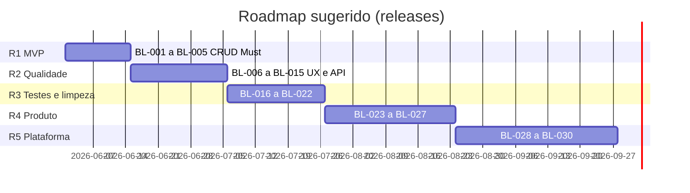

# PRD — Product Requirements Document

## ProCienciaWeb (Pró Ciência)

**Documento:** Product Requirements Document  
**Produto:** ProCienciaWeb — interface web do ecossistema Pró Ciência  
**Versão:** 1.1  
**Data:** 2026-05-23  
**Status:** Rascunho aprovado para planejamento (Fase 5 + backlog)

**Referências:** [`inventario-tecnico.md`](./inventario-tecnico.md) · [`architecture.md`](./architecture.md) · [`codebase-overview.md`](./codebase-overview.md) · [`PLANO-EXECUCAO-POR-FASES.md`](./PLANO-EXECUCAO-POR-FASES.md)

---

## 1. Resumo executivo

O **ProCienciaWeb** é o front-end web do programa **Pró Ciência**, voltado ao cadastro e à consulta de **projetos científicos** por pesquisadores e equipes de gestão. A aplicação atua como cliente de apresentação (**thin client**) para a API REST hospedada em Azure (`apiprociencia.azurewebsites.net`), compartilhada com apps móveis do mesmo ecossistema (`ServicoProCiencia`, `AppProCiencia` / `ProCienciaApp`).

O produto encontra-se em estágio **MVP funcional parcial**: listagem e inclusão operam de forma básica; edição e exclusão estão incompletas ou ausentes no cliente. Este PRD consolida a visão de produto, personas, requisitos, o mapa **atual vs. planejado** e o **backlog priorizado** (MoSCoW), alinhado ao estado real do repositório (análise das Fases 1–3).

---

## 2. Visão e objetivos

### 2.1 Visão

Oferecer uma interface web simples, em português, para que pesquisadores e gestores **registrem, consultem e mantenham** projetos científicos do Pró Ciência, com dados consistentes em área e subárea de conhecimento, integrados ao mesmo backend utilizado pelos demais canais do programa.

### 2.2 Objetivos de produto

| ID | Objetivo | Indicador de sucesso (desejado) |
|----|----------|----------------------------------|
| O1 | Permitir cadastro completo de projetos via web | Inclusão com todos os campos obrigatórios persistidos, incluindo subárea |
| O2 | Permitir manutenção do ciclo de vida (consultar, editar, excluir) | CRUD completo funcional na UI, refletido na API |
| O3 | Facilitar localização de projetos | Filtro ou busca por área/subárea com resposta aceitável ao usuário |
| O4 | Manter paridade conceitual com o ecossistema | Contrato REST estável; alterações coordenadas com API e apps móveis |
| O5 | Preparar evolução sustentável | Configuração por ambiente, tratamento de erros e base para autenticação futura |

### 2.3 Escopo

**Dentro do escopo (ProCienciaWeb):**

- Interface Blazor Server para gestão de **projetos** (listar, incluir, editar, excluir).
- Consumo de endpoints de **Projetos**, **SubÁreas**, **Áreas** e **Instituições** expostos pela API Pró Ciência.
- Navegação, formulários e feedback de operação ao usuário final.

**Fora do escopo deste produto (outros sistemas / fases):**

- Regras de negócio e persistência (responsabilidade da **API** / `ServicoProCiencia`).
- Aplicativos móveis.
- Autenticação e autorização **no backend** (podem existir na API; o front hoje não as consome).
- Relatórios analíticos, workflow de aprovação, notificações por e-mail, integrações com Lattes ou órgãos de fomento.

### 2.4 Premissas de produto

| ID | Premissa |
|----|----------|
| P1 | A API Azure está disponível e o contrato JSON é compatível com os modelos `Projeto`, `Area`, `SubArea`, `Instituicao`. |
| P2 | O volume inicial de projetos permite listagem em memória no servidor Blazor para filtro simples. |
| P3 | Usuários acessam o sistema via navegador moderno com suporte a HTTPS e WebSocket (SignalR do Blazor Server). |
| P4 | Não há exigência formal de login no front na versão atual; controle de acesso pode ser evolução futura coordenada com a API. |

### 2.5 Restrições conhecidas

| ID | Restrição | Impacto no produto |
|----|-----------|-------------------|
| C1 | Front em **.NET Core 3.1** (EOL) | Risco de segurança e suporte; modernização planejada fora deste PRD (Fase 8). |
| C2 | URL da API **fixa no código** | Dificulta ambientes dev/homolog/prod sem rebuild. |
| C3 | Sem autenticação no pipeline ASP.NET | Qualquer visitante com URL pode usar as telas expostas. |
| C4 | CRUD incompleto no cliente | Editar não persiste; excluir não executa chamada à API. |

---

## 3. Personas

### 3.1 Pesquisador (persona primária)

| Atributo | Descrição |
|----------|-----------|
| **Perfil** | Docente ou pesquisador vinculado a instituição de ensino/pesquisa, participante do Pró Ciência. |
| **Objetivos** | Registrar seu projeto, revisar dados cadastrados e corrigir informações (título, resumo, contato, área). |
| **Comportamento** | Acesso esporádico; prefere formulários diretos e poucos passos; tolerância baixa a erros silenciosos. |
| **Dores atuais** | Edição que não salva; subárea possivelmente não gravada na inclusão; ausência de mensagem clara quando a API falha. |
| **Canal** | Navegador desktop ou notebook; possivelmente também app móvel do mesmo backend. |

### 3.2 Gestor / coordenador do programa (persona secundária)

| Atributo | Descrição |
|----------|-----------|
| **Perfil** | Responsável por acompanhar projetos cadastrados na instituição ou no programa. |
| **Objetivos** | Listar projetos, filtrar por área de conhecimento, identificar cadastros incompletos ou duplicados, solicitar correções ou remover registros inválidos. |
| **Comportamento** | Consulta frequente à listagem; necessita de busca rápida e ações de manutenção (editar/excluir) confiáveis. |
| **Dores atuais** | Botão excluir sem efeito; filtro recarrega todos os registros a cada tecla; risco de `NullReference` se a API não popular `SubArea` na listagem. |
| **Canal** | Navegador em ambiente institucional. |

### 3.3 Administrador de sistemas (persona terciária — não usuário final de negócio)

| Atributo | Descrição |
|----------|-----------|
| **Perfil** | Responsável por deploy, configuração e integração com Azure. |
| **Objetivos** | Publicar o front, apontar para a API correta por ambiente, garantir HTTPS e disponibilidade. |
| **Dores atuais** | URL da API hardcoded; ausência de perfis em `appsettings`; .NET 3.1 sem suporte estendido. |

*Nota: persona “administrador de cadastros” (gestão de áreas, instituições) pode emergir quando a UI consumir `ObterAreas` e `ObterInstituicoes`; hoje esses endpoints existem apenas no cliente HTTP, sem tela.*

---

## 4. Casos de uso e jornadas principais

### 4.1 Casos de uso

| ID | Caso de uso | Ator | Prioridade de negócio |
|----|-------------|------|------------------------|
| CU-01 | Consultar lista de projetos | Pesquisador, Gestor | Alta |
| CU-02 | Filtrar projetos por área/subárea (texto) | Gestor | Média |
| CU-03 | Incluir novo projeto | Pesquisador | Alta |
| CU-04 | Editar projeto existente | Pesquisador, Gestor | Alta |
| CU-05 | Excluir projeto | Gestor | Alta |
| CU-06 | Navegar entre home, lista e formulários | Todos | Média |
| CU-07 | Selecionar subárea de conhecimento no formulário | Pesquisador | Alta |
| CU-08 | Tratar falha de comunicação com a API | Todos | Média |
| CU-09 | Consultar catálogos de áreas e instituições (futuro) | Gestor, Admin cadastros | Baixa |

### 4.2 Jornada: cadastrar novo projeto

1. Usuário acessa **Projetos** (`/listaprojetos`) e clica em **Novo Projeto**.
2. Sistema carrega subáreas via `GET /api/SubAreas` (`/incluirprojeto`).
3. Usuário preenche título, autor, telefone, e-mail, resumo e seleciona subárea.
4. Sistema envia `POST /api/Projetos/` e redireciona para a listagem.
5. **Estado atual:** passo 3 pode falhar em silêncio no vínculo `SubAreaId` (select sem `@bind`); passo 4 não valida status HTTP.

### 4.3 Jornada: editar projeto existente

1. Na listagem, usuário clica **Editar** → `/editarprojeto/{projetoId}`.
2. Sistema carrega subáreas e projeto (`GET /api/SubAreas`, `GET /api/Projetos/{id}`).
3. Usuário altera campos e confirma.
4. Sistema persiste alterações e retorna à listagem.
5. **Estado atual:** passos 1–2 OK; passo 4 **não ocorre** (update comentado; apenas navegação).

### 4.4 Jornada: excluir projeto

1. Na listagem, usuário clica **Excluir** na linha do projeto.
2. Sistema confirma (desejado) e chama `DELETE /api/Projetos/{id}`.
3. Listagem é atualizada.
4. **Estado atual:** handler `ExcluirProjeto` **vazio** — nenhum efeito.

### 4.5 Jornada: filtrar na listagem

1. Usuário digita no campo “Área de conhecimento…”.
2. Sistema restringe a tabela aos projetos cuja `SubArea.Nome` contém o texto (case insensitive).
3. **Estado atual:** funcional, porém com re-fetch bloqueante (`.Wait()` em fluxo async) e carga completa da lista a cada tecla.

---

## 5. Funcionalidades: estado atual vs. planejado

Legenda de status: **OK** · **Parcial** · **Ausente** · **Legado** (template sem valor de negócio)

| ID | Funcionalidade | Rota / módulo | Atual | Planejado |
|----|----------------|---------------|-------|-----------|
| F01 | Página inicial informativa | `/` · `Index.razor` | OK | Manter; eventual conteúdo institucional |
| F02 | Listar projetos | `/listaprojetos` · `ListaProjetos` | OK | Manter; melhorar performance do filtro |
| F03 | Filtrar por subárea (texto, client-side) | `ListaProjetos` | OK | Evoluir: debounce, filtro server-side opcional |
| F04 | Navegar para inclusão | Link em `ListaProjetos` | OK | Manter |
| F05 | Incluir projeto (POST) | `/incluirprojeto` | Parcial | OK com bind de `SubAreaId` e validação |
| F06 | Carregar subáreas no formulário | `IncluirProjeto`, `EditarProjeto` | OK | Manter; cascata Área → Subárea (opcional) |
| F07 | Carregar projeto para edição | `/editarprojeto/{id}` | OK | Manter |
| F08 | Salvar alterações (PUT/PATCH) | `EditarProjeto` | Ausente | Implementar update na API + `ApiService` |
| F09 | Excluir projeto (DELETE) | `ListaProjetos` | Ausente | Implementar com confirmação |
| F10 | Exibir e selecionar área no formulário | `ApiService.ObterAreas` | Ausente na UI | Should: dropdown de área antes da subárea |
| F11 | Vincular instituição ao projeto | `ApiService.ObterInstituicoes` | Ausente na UI | Could: campo instituição se API/modelo suportarem |
| F12 | Feedback de erro / sucesso de API | — | Ausente | Mensagens e estados de loading consistentes |
| F13 | Autenticação e perfis de acesso | Pipeline ASP.NET | Ausente | Should (coordenado com API): login e autorização |
| F14 | Validação de formulário | Formulários | Ausente | Campos obrigatórios, e-mail, tamanhos |
| F15 | Configuração de URL da API por ambiente | `ApiService` | Ausente | `appsettings.{Environment}.json` |
| F16 | Contador / template Blazor | `/counter` | Legado | Remover do produto |
| F17 | Deploy do front em Azure / IIS | — | Ausente (só local) | Publicação alinhada à API |

---

## 6. Requisitos funcionais

Requisitos numerados para rastreabilidade com casos de uso, páginas e endpoints.

| ID | Requisito | CU | Estado | Referência técnica |
|----|-----------|-----|--------|------------------|
| **RF-001** | O sistema deve exibir a lista de todos os projetos retornados por `GET /api/Projetos`, com colunas título, autor e área de conhecimento (nome da subárea). | CU-01 | Atendido | `ListaProjetos.razor` |
| **RF-002** | O sistema deve permitir filtrar a lista em tempo real pelo nome da subárea, sem distinção de maiúsculas/minúsculas. | CU-02 | Atendido (com ressalvas de performance) | `ListaProjetos.razor` |
| **RF-003** | O sistema deve disponibilizar ação para abrir o formulário de inclusão de projeto. | CU-03 | Atendido | Link `/incluirprojeto` |
| **RF-004** | O sistema deve carregar as subáreas disponíveis ao abrir os formulários de inclusão e edição. | CU-07 | Atendido | `GET /api/SubAreas` |
| **RF-005** | O sistema deve permitir cadastrar um projeto com os campos: título, resumo, autor, telefone, e-mail e subárea de conhecimento. | CU-03 | Parcial | `IncluirProjeto.razor`; `SubAreaId` pode não ser enviado |
| **RF-006** | O sistema deve enviar o payload de inclusão para `POST /api/Projetos/` e, em caso de sucesso, redirecionar o usuário para a listagem. | CU-03 | Parcial | Sem verificação de status HTTP |
| **RF-007** | O sistema deve carregar os dados de um projeto específico para edição via `GET /api/Projetos/{id}`. | CU-04 | Atendido | `EditarProjeto.razor` |
| **RF-008** | O sistema deve persistir alterações de um projeto existente via operação de atualização na API (PUT ou PATCH). | CU-04 | **Não atendido** | Update comentado |
| **RF-009** | O sistema deve permitir excluir um projeto mediante ação na listagem e chamada `DELETE` à API. | CU-05 | **Não atendido** | `ExcluirProjeto` vazio |
| **RF-010** | O sistema deve associar explicitamente o identificador da subárea selecionada (`SubAreaId`) ao projeto nos formulários de inclusão e edição. | CU-07 | **Não atendido** | Select sem `@bind` |
| **RF-011** | O sistema deve exibir estado de carregamento enquanto listas ou projetos são obtidos da API. | CU-01, CU-04 | Parcial | Texto “Carregando…” na lista |
| **RF-012** | O sistema deve informar o usuário quando a API estiver indisponível ou retornar erro, sem encerrar a sessão de forma abrupta. | CU-08 | **Não atendido** | — |
| **RF-013** | O sistema deve oferecer navegação entre Home e Projetos por menu lateral. | CU-06 | Atendido | `NavMenu.razor` |
| **RF-014** | O sistema deve solicitar confirmação antes de excluir um projeto (desejado para evitar exclusão acidental). | CU-05 | Planejado | — |
| **RF-015** | O sistema deve permitir seleção de área de conhecimento e filtragem de subáreas dependentes (desejado). | CU-07 | Planejado | `ObterAreas` sem UI |
| **RF-016** | O sistema deve validar campos obrigatórios e formato de e-mail antes de submeter formulários. | CU-03, CU-04 | Planejado | Sem `DataAnnotations` nos modelos |
| **RF-017** | O sistema deve restringir operações de escrita a usuários autenticados quando o programa exigir controle de acesso (evolução). | — | Planejado | Sem auth no `Startup` |

---

## 7. Requisitos não funcionais

| ID | Categoria | Requisito | Situação atual | Meta |
|----|-----------|-----------|----------------|------|
| **RNF-001** | Disponibilidade | O front depende da disponibilidade da API Azure; indisponibilidade deve ser comunicada na UI. | API única; sem fallback | Mensagem amigável + retry opcional |
| **RNF-002** | Performance | A listagem deve permanecer utilizável com centenas de projetos em rede institucional típica. | GET completo + filtro em memória | Debounce no filtro; considerar paginação na API |
| **RNF-003** | Performance | Operações de filtro não devem bloquear a thread do circuito Blazor. | Uso de `.Wait()` em async | Refatorar para `await` |
| **RNF-004** | Usabilidade | Interface em português, layout responsivo básico (Bootstrap). | Atendido | Manter padrão visual do programa |
| **RNF-005** | Usabilidade | Formulários devem indicar campos obrigatórios e erros de validação. | Não implementado | Validação client-side Blazor |
| **RNF-006** | Compatibilidade | Suporte a navegadores modernos (Chrome, Edge, Firefox) com HTTPS e WebSocket. | Blazor Server | Documentar versões mínimas |
| **RNF-007** | Segurança | Comunicação com API e usuário via HTTPS. | HTTPS em dev (`launchSettings`) | HTTPS obrigatório em produção |
| **RNF-008** | Segurança | Ausência de segredos e URLs sensíveis no repositório; configuração por ambiente. | URL hardcoded | `appsettings` / variáveis de ambiente |
| **RNF-009** | Segurança | Autenticação e autorização conforme política do Pró Ciência (futuro). | Acesso anônimo ao front | Integrar com mecanismo da API |
| **RNF-010** | Manutenibilidade | Código alinhado a versão .NET com suporte ativo. | .NET Core 3.1 EOL | Migração .NET 8 (roadmap Fase 8) |
| **RNF-011** | Manutenibilidade | Cliente HTTP resiliente (DNS, sockets, timeouts). | `HttpClient` estático | `IHttpClientFactory` |
| **RNF-012** | Observabilidade | Erros de integração registrados para diagnóstico. | Logging padrão ASP.NET | Log estruturado de chamadas à API |
| **RNF-013** | Testabilidade | Comportamento crítico coberto por testes automatizados. | Sem projeto de testes | xUnit + mocks HTTP (Fase 8) |
| **RNF-014** | Escalabilidade | Comportamento previsível sob múltiplos usuários simultâneos (Blazor Server). | Estado por circuito SignalR | Monitorar; avaliar WASM se tráfego crescer |
| **RNF-015** | Integração | Contrato REST compatível com `ServicoProCiencia` e clientes móveis. | Modelos DTO espelhando API | Versionamento coordenado de API |

---

## 8. Modelo de informação (visão de produto)

Entidade central exposta na UI:

| Campo | Descrição | Obrigatório (negócio) | Formulário atual |
|-------|-----------|------------------------|------------------|
| Título | Nome do projeto científico | Sim | Sim |
| Resumo | Descrição resumida | Sim | Sim |
| Autor | Responsável / autor principal | Sim | Sim |
| Telefone | Contato | Recomendado | Sim |
| E-mail | Contato | Sim | Sim |
| Subárea | Classificação (`SubAreaId` / `SubArea.Nome`) | Sim | Exibido; **vínculo de ID incompleto** |
| Área | Classificação superior (`AreaId`) | Derivada da subárea | Não exposto na UI |
| Instituição | Vínculo institucional | A definir com API | Não exposto na UI |

---

## 9. Integrações e dependências de produto

| Sistema | Papel | Impacto se indisponível |
|---------|-------|-------------------------|
| API Pró Ciência (`apiprociencia.azurewebsites.net`) | Fonte da verdade dos dados | Front inoperante para listagem e CRUD |
| Azure App Service | Hospedagem da API | Mesmo que acima |
| Apps móveis (ecossistema) | Consumidores paralelos da API | Mudanças de contrato exigem coordenação |
| SignalR (`/_blazor`) | Atualização UI Blazor Server | Perda de interatividade se WebSocket bloqueado |

---

## 10. Métricas e critérios de aceite (produto)

| Métrica | Definição | Baseline atual | Meta MVP completo |
|---------|-----------|----------------|-------------------|
| Completude CRUD | % operações CRUD funcionais na UI | 50% (2/4: listar, criar parcial) | 100% |
| Integridade de cadastro | Inclusões com `SubAreaId` válido | Incerto | 100% das submissões |
| Taxa de erro silencioso | Ações sem feedback após falha de API | Alta | Zero para fluxos principais |
| Tempo percebido na listagem | Carregamento inicial + filtro | Aceitável em volume baixo | &lt; 3 s em rede institucional |

**Critério de aceite do MVP completo (produto):**

1. Pesquisador consegue **incluir** projeto com subárea correta e vê o registro na listagem.
2. Pesquisador consegue **editar** e **salvar** alterações refletidas na API.
3. Gestor consegue **excluir** projeto com confirmação e lista atualizada.
4. Usuário recebe mensagem compreensível quando a API falhar.
5. Funcionalidades mapeadas nas rotas `/listaprojetos`, `/incluirprojeto`, `/editarprojeto/{id}` sem regressão em CU-01 e CU-06.

---

## 11. Riscos de produto

| Risco | Probabilidade | Impacto | Mitigação |
|-------|---------------|---------|-----------|
| Dados incorretos por `SubAreaId` não enviado | Alta | Alto | RF-010; correção prioritária |
| Usuário acredita ter salvo edição | Alta | Alto | RF-008; comunicação clara na UI |
| Exclusão acidental sem confirmação | Média | Médio | RF-014 |
| API fora do ar sem mensagem | Média | Alto | RF-012, RNF-001 |
| Divergência web vs. mobile após mudança de API | Média | Alto | Governança de contrato REST |
| .NET 3.1 sem patches | Alta | Médio | RNF-010 |

---

## 12. Backlog priorizado

Backlog de produto e engenharia do **ProCienciaWeb**, priorizado com **MoSCoW** (Must / Should / Could). Itens derivados dos requisitos (RF/RNF), funcionalidades (F), débitos técnicos (DT) do [`codebase-overview.md`](./codebase-overview.md) e critérios de aceite do MVP (seção 10).

**Legenda**

| Campo | Significado |
|-------|-------------|
| **Prioridade** | **Must** = bloqueia MVP completo · **Should** = alto valor, próxima release · **Could** = desejável, sem urgência |
| **Status** | `A fazer` · `Em progresso` · `Concluído` · `Bloqueado` |
| **Esforço** | S (&lt; 1 dia) · M (1–2 dias) · L (&gt; 1 semana) |
| **Release** | Agrupamento sugerido para planejamento |

### 12.1 Épico E1 — MVP CRUD completo (Must)

| ID | Item | Prioridade | RF/RNF | F/DT | Esforço | Status | Release |
|----|------|------------|--------|------|---------|--------|---------|
| **BL-001** | Vincular `SubAreaId` nos selects de inclusão e edição (`@bind` / `@bind-value`) | Must | RF-010 | F05, DT-03 | S | A fazer | R1 |
| **BL-002** | Implementar atualização de projeto (`PUT` ou `PATCH` em `ApiService` + `EditarProjeto`) | Must | RF-008 | F08, DT-01 | M | A fazer | R1 |
| **BL-003** | Implementar exclusão de projeto (`DELETE` em `ApiService` + handler em `ListaProjetos`) | Must | RF-009 | F09, DT-02 | M | A fazer | R1 |
| **BL-004** | Validar resposta HTTP do `POST` de inclusão antes de redirecionar | Must | RF-006 | F05 | S | A fazer | R1 |
| **BL-005** | Diálogo de confirmação antes de excluir projeto | Must | RF-014 | F09 | S | A fazer | R1 |

**Critério de conclusão do épico E1:** critérios de aceite 1–3 da seção 10 atendidos; CRUD 100% na UI.

### 12.2 Épico E2 — Confiabilidade e UX (Should)

| ID | Item | Prioridade | RF/RNF | F/DT | Esforço | Status | Release |
|----|------|------------|--------|------|---------|--------|---------|
| **BL-006** | Tratamento de erros HTTP na UI (mensagens amigáveis, sem quebra de circuito) | Should | RF-012, RNF-001 | F12, DT-08 | M | A fazer | R2 |
| **BL-007** | Validação de formulários (campos obrigatórios, formato de e-mail) | Should | RF-016, RNF-005 | F14 | M | A fazer | R2 |
| **BL-008** | Externalizar URL da API em `appsettings` / variáveis de ambiente | Should | RNF-008 | F15, DT-05 | S | A fazer | R2 |
| **BL-009** | Corrigir filtro assíncrono (remover `.Wait()`, usar `await` em `ListaProjetos`) | Should | RNF-003 | F03, DT-07 | S | A fazer | R2 |
| **BL-010** | Proteger listagem quando `SubArea` for null (exibir placeholder ou área vazia) | Should | RF-001 | — | S | A fazer | R2 |
| **BL-011** | Debounce no campo de filtro da listagem (evitar re-fetch a cada tecla) | Should | RNF-002 | F03, DT-09 | M | A fazer | R2 |
| **BL-012** | Seleção em cascata Área → Subárea nos formulários (`ObterAreas` + filtro de subáreas) | Should | RF-015 | F10, DT-12 | M | A fazer | R2 |
| **BL-013** | Estados de loading e feedback de sucesso consistentes em todas as páginas de dados | Should | RF-011 | F12 | S | A fazer | R2 |
| **BL-014** | Substituir `HttpClient` estático por `IHttpClientFactory` / typed client | Should | RNF-011 | DT-06 | M | A fazer | R2 |
| **BL-015** | Verificar status HTTP em todos os métodos de `ApiService` (`EnsureSuccessStatusCode` ou equivalente) | Should | RF-012 | DT-08 | M | A fazer | R2 |

**Critério de conclusão do épico E2:** critério de aceite 4 da seção 10; RNF-001, RNF-003 e RNF-005 em meta.

### 12.3 Épico E3 — Qualidade e higiene (Should / Could)

| ID | Item | Prioridade | RF/RNF | F/DT | Esforço | Status | Release |
|----|------|------------|--------|------|---------|--------|---------|
| **BL-016** | Projeto de testes xUnit para `ApiService` (mocks HTTP) | Should | RNF-013 | DT-13 | L | A fazer | R3 |
| **BL-017** | Remover artefatos de template (`Counter`, `WeatherForecast`, `SurveyPrompt`, DI órfã) | Could | — | F16, DT-11 | S | A fazer | R3 |
| **BL-018** | Remover código legado não compilado (`Controller/`, `IncluirProjeto.cshtml*`, `Component.razor`) | Could | — | DT-10 | S | A fazer | R3 |
| **BL-019** | Extrair componente compartilhado `FormularioProjeto.razor` (DRY incluir/editar) | Could | — | — | M | A fazer | R3 |
| **BL-020** | Tipar parâmetro de rota `projetoId` como `int` em `EditarProjeto` | Could | — | DT-15 | S | A fazer | R3 |
| **BL-021** | Eliminar warnings CS1998 (async sem await) | Could | — | DT-14 | S | A fazer | R3 |
| **BL-022** | Logging estruturado de chamadas à API | Could | RNF-012 | — | S | A fazer | R3 |

### 12.4 Épico E4 — Evolução de produto (Could)

| ID | Item | Prioridade | RF/RNF | F/DT | Esforço | Status | Release |
|----|------|------------|--------|------|---------|--------|---------|
| **BL-023** | Campo instituição no formulário (se API e modelo `Projeto` suportarem) | Could | — | F11 | M | A fazer | R4 |
| **BL-024** | Autenticação e autorização no front (coordenado com API) | Could | RF-017, RNF-009 | F13 | L | A fazer | R4 |
| **BL-025** | Publicar front-end em Azure App Service / IIS com HTTPS | Could | RNF-007 | F17 | M | A fazer | R4 |
| **BL-026** | Conteúdo institucional na home (`Index.razor`) | Could | — | F01 | S | A fazer | R4 |
| **BL-027** | Filtro server-side ou paginação na listagem (depende da API) | Could | RNF-002 | F03 | L | Bloqueado | R4 |

*BL-027 bloqueado até a API expor query de filtro/paginação.*

### 12.5 Épico E5 — Modernização de plataforma (Could — coordenar com Fase 8)

| ID | Item | Prioridade | RF/RNF | F/DT | Esforço | Status | Release |
|----|------|------------|--------|------|---------|--------|---------|
| **BL-028** | Migração .NET Core 3.1 → .NET 8 | Could | RNF-010 | DT-04 | L | A fazer | R5 |
| **BL-029** | Testes E2E Playwright (fluxos listar, incluir, editar, excluir) | Could | RNF-013 | — | L | A fazer | R5 |
| **BL-030** | Documentar versões mínimas de navegador | Could | RNF-006 | — | S | A fazer | R5 |

### 12.6 Visão consolidada do backlog

| Prioridade | Qtd. itens | Objetivo |
|------------|------------|----------|
| **Must** | 5 | Fechar MVP CRUD (Release R1) |
| **Should** | 10 | Confiabilidade, validação e deploy configurável (R2) |
| **Could** | 15 | Higiene, evolução de produto e modernização (R3–R5) |

*Datas ilustrativas — ajustar conforme capacidade da equipe.*

### 12.7 Rastreabilidade backlog → requisitos

| Release | Itens | Requisitos cobertos |
|---------|-------|---------------------|
| **R1** | BL-001 … BL-005 | RF-006, RF-008, RF-009, RF-010, RF-014 · MVP seção 10 |
| **R2** | BL-006 … BL-015 | RF-011, RF-012, RF-015, RF-016 · RNF-001, RNF-002, RNF-003, RNF-005, RNF-008, RNF-011 |
| **R3** | BL-016 … BL-022 | RNF-012, RNF-013 |
| **R4** | BL-023 … BL-027 | RF-017 · RNF-002, RNF-007, RNF-009 |
| **R5** | BL-028 … BL-030 | RNF-006, RNF-010, RNF-013 |

### 12.8 Itens já concluídos (baseline)

Nenhum item de backlog de implementação está **Concluído** no código atual. Funcionalidades em produção parcial (listar, incluir parcial, filtrar) correspondem ao estado **antes** do backlog — não geram itens `Concluído` até revalidação pós-entrega.

---

## 13. Roadmap de produto

Fases alinhadas ao [`PLANO-EXECUCAO-POR-FASES.md`](./PLANO-EXECUCAO-POR-FASES.md):

| Fase | Entregável | Relação com backlog |
|------|------------|---------------------|
| 5 | PRD (este documento) | Seção 12 — backlog MoSCoW |
| 6 | TDD | Detalha como implementar BL-001 … BL-015 |
| 8 | `roadmap-testes-migracao.md` | Aprofunda BL-016, BL-028, BL-029 |

**Horizonte por release:**

| Release | Foco | Itens principais |
|---------|------|------------------|
| **R1** | MVP CRUD | BL-001 … BL-005 |
| **R2** | UX e confiabilidade | BL-006 … BL-015 |
| **R3** | Testes e higiene | BL-016 … BL-022 |
| **R4** | Evolução de produto | BL-023 … BL-027 |
| **R5** | Plataforma | BL-028 … BL-030 |

---

## 14. Glossário

| Termo | Definição |
|-------|-----------|
| **Pró Ciência** | Programa / ecossistema de apoio a projetos científicos |
| **Projeto** | Registro de projeto científico com metadados e classificação por área |
| **Subárea** | Subdivisão de uma área de conhecimento |
| **API Pró Ciência** | Backend REST em Azure consumido pelo ProCienciaWeb |
| **MVP** | Versão mínima utilizável; aqui, com lacunas conscientes no CRUD |

---

## 15. Histórico do documento

| Versão | Data | Autor | Alteração |
|--------|------|-------|-----------|
| 1.0 | 2026-05-23 | Documentação Fase 5 | Versão inicial com base nas Fases 1–3 |
| 1.1 | 2026-05-23 | Documentação Fase 5 | Backlog priorizado (BL-001 … BL-030), épicos e releases R1–R5 |

**Próximo passo:** Fase 6 — `docs/TDD.md` (decisões técnicas, contratos REST, segurança e deploy).
