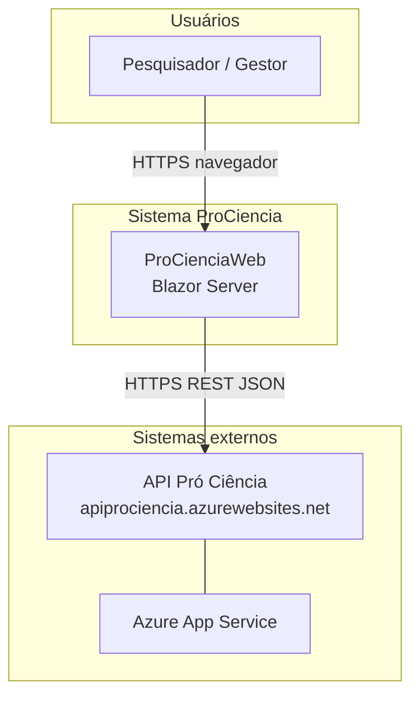
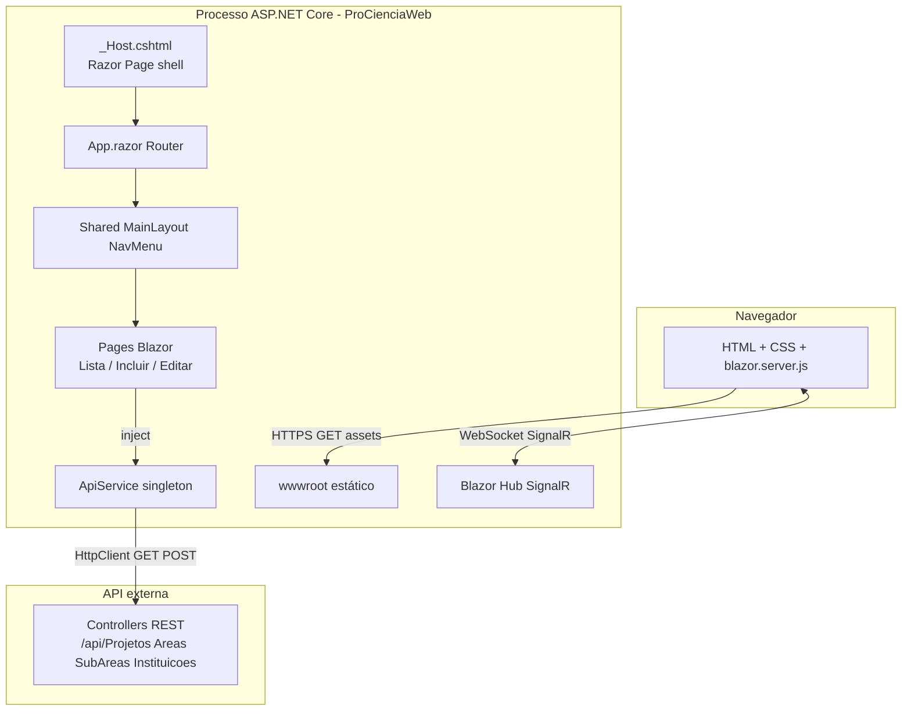
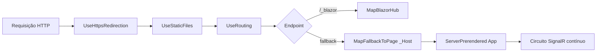
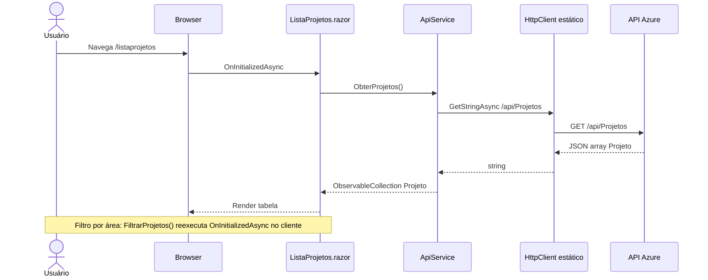
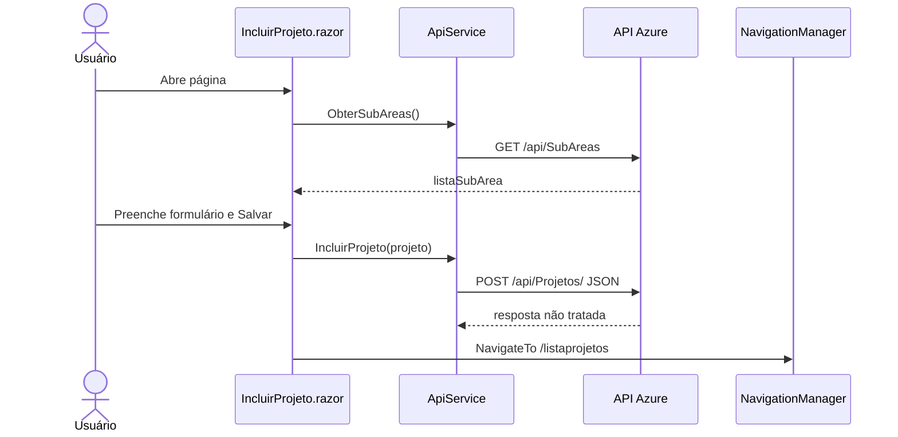
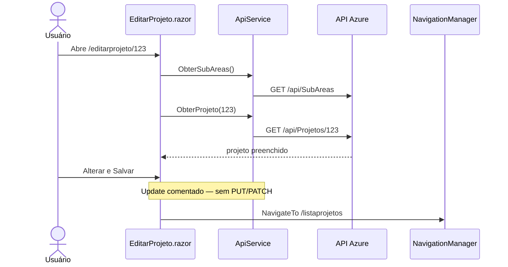
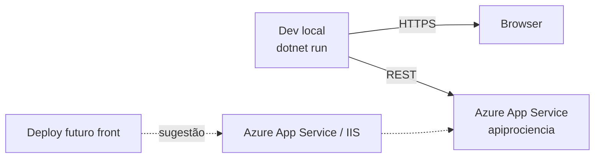
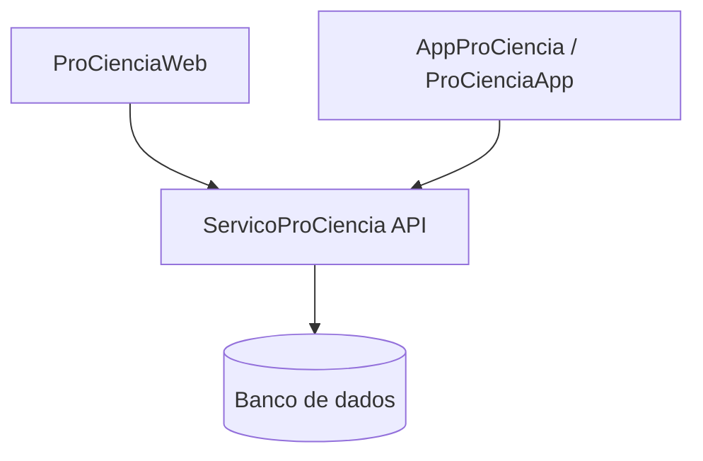

# Arquitetura — ProCienciaWeb

Documento gerado na **Fase 2** do plano de execução. Descreve a arquitetura do front-end Blazor Server, integração com a API Azure e fluxos principais de cadastro de projetos científicos.

**Referências:** [`inventario-tecnico.md`](./inventario-tecnico.md) · [`PLANO-EXECUCAO-POR-FASES.md`](./PLANO-EXECUCAO-POR-FASES.md)  
**Data:** 2026-05-22

---

## 1. Visão geral

O **ProCienciaWeb** é uma aplicação **ASP.NET Core 3.1 Blazor Server** que atua como **cliente de apresentação** (thin client) para a API REST hospedada em **Azure App Service** (`apiprociencia.azurewebsites.net`). Não há persistência local nem camada de domínio no front: componentes Razor injetam `ApiService`, que serializa/deserializa JSON via **Newtonsoft.Json** e chama endpoints REST. A UI roda no servidor com atualização em tempo real via **SignalR** (`MapBlazorHub`); o navegador recebe HTML pré-renderizado (`ServerPrerendered`) e mantém circuito Blazor ativo.

---

## 2. Diagrama C4 — Nível 1 (Contexto)



| Elemento | Descrição |
|----------|-----------|
| **Pesquisador / Gestor** | Usuário que lista, inclui ou tenta editar projetos científicos via browser |
| **ProCienciaWeb** | Front-end Blazor Server; sem autenticação própria |
| **API Pró Ciência** | Backend REST (repositório relacionado: `ServicoProCiencia`) |
| **Azure App Service** | Hospedagem da API (e potencialmente do front em deploy futuro) |

---

## 3. Diagrama C4 — Nível 2 (Containers)



| Container | Tecnologia | Responsabilidade |
|-----------|------------|------------------|
| **Navegador** | HTML5, Bootstrap, Open Iconic | UI; circuito Blazor via SignalR |
| **_Host + App.razor** | Razor Pages + Blazor | Bootstrap da SPA Blazor Server |
| **Pages (Blazor)** | `.razor` | Casos de uso: listar, incluir, editar projetos |
| **ApiService** | C# + HttpClient estático | Cliente REST único para API Azure |
| **wwwroot** | Arquivos estáticos | CSS, ícones, favicon |
| **API REST** | ASP.NET (externo) | Persistência e regras de negócio |

---

## 4. Pipeline ASP.NET Core

Fluxo de uma requisição HTTP até a renderização Blazor:



| Etapa | Middleware / endpoint | Arquivo |
|-------|----------------------|---------|
| Bootstrap | `Program.Main` → `CreateHostBuilder` | `Program.cs` |
| DI | `AddServerSideBlazor`, `AddSingleton<ApiService>` | `Startup.ConfigureServices` |
| Dev/Prod errors | `UseDeveloperExceptionPage` / `UseExceptionHandler("/Error")` | `Startup.Configure` |
| Blazor | `MapBlazorHub` + `MapFallbackToPage("/_Host")` | `Startup.Configure` |
| Roteamento UI | `Router` em `App.razor` | `App.razor` |

**Premissa:** não há `UseAuthentication` / `UseAuthorization` — acesso anônimo ao front e dependência da API para qualquer proteção futura.

---

## 5. Fluxo de dados: UI → ApiService → API

```mermaid
flowchart LR
  subgraph ui [Camada UI Blazor]
    P[Pages .razor]
  end

  subgraph app [Camada aplicação]
    A[ApiService]
    M[Models DTO]
  end

  subgraph remote [Remoto]
    API[REST API Azure]
  end

  P -->|@inject ApiService| A
  A -->|JsonConvert| M
  A -->|HttpClient| API
  API -->|JSON| A
  A --> M
  M --> P
```

| Camada | Artefatos | Observação |
|--------|-----------|------------|
| **UI** | `ListaProjetos`, `IncluirProjeto`, `EditarProjeto` | `@inject ApiService`; ciclo de vida `OnInitializedAsync` |
| **Cliente API** | `ApiService.cs` | URL fixa; `HttpClient` estático compartilhado |
| **DTOs** | `Models/*.cs` | Sem EF; espelham contrato JSON da API |
| **Backend** | `apiprociencia.azurewebsites.net` | Fonte da verdade dos dados |

---

## 6. Diagramas de sequência

### 6.1 Listar projetos (`/listaprojetos`)



**Comportamento adicional:** filtro por `SubArea.Nome` é feito **no servidor Blazor** após o GET completo (`Where` + `Contains`), não via query string na API.

### 6.2 Incluir projeto (`/incluirprojeto`)



**Lacuna:** o `<select>` de subárea não faz `@bind` em `SubAreaId` — o POST pode enviar `SubAreaId = 0`.

### 6.3 Editar projeto (`/editarprojeto/{projetoId}`)



**Estado atual:** fluxo de leitura completo; **persistência de alterações não implementada**.

---

## 7. Decisões arquiteturais implícitas

| Decisão | Implementação atual | Consequência |
|---------|---------------------|--------------|
| **Blazor Server** | `AddServerSideBlazor`, `ServerPrerendered` | Estado UI no servidor; requer conexão SignalR estável; escala por sessão |
| **API externa única** | Sem EF/SQL local | Front depende 100% da disponibilidade da API Azure |
| **ApiService singleton** | `AddSingleton<ApiService>()` | Uma instância por app; adequado se stateless, mas compartilha `HttpClient` estático |
| **HttpClient estático** | `public static HttpClient client` | Risco de socket exhaustion em cenários de alta carga; anti-pattern em .NET moderno |
| **URL hardcoded** | `UrlServico` constante em código | Sem perfis dev/staging/prod via `appsettings` |
| **Newtonsoft.Json** | Serialização manual | Diferente do `System.Text.Json` padrão em versões mais novas |
| **Sem autenticação no front** | Pipeline sem auth | Qualquer visitante acessa CRUD exposto na UI |
| **Sem camada de serviço de domínio** | Pages chamam `ApiService` direto | Simplicidade inicial; difícil testar UI isoladamente |
| **Controller legado excluído** | `Controller/**` removido do build | `ApiService` é o único cliente HTTP ativo |

---

## 8. Integrações externas

| Sistema | URL / protocolo | Direção | Dados |
|---------|-----------------|---------|-------|
| API Pró Ciência | `https://apiprociencia.azurewebsites.net` | Saída (cliente) | Projetos, Áreas, SubÁreas, Instituições |
| CDN / estáticos | Local `wwwroot` | Entrada | CSS Bootstrap, Open Iconic |
| SignalR (interno) | `/_blazor` | Bidirecional | Eventos de UI Blazor |

Não há integração com filas, e-mail, storage ou identity provider no código atual.

---

## 9. Contratos REST consumidos

Base: `https://apiprociencia.azurewebsites.net`

| Verbo | Endpoint | Método ApiService | Request body | Response | UI consumidora |
|-------|----------|-------------------|--------------|----------|----------------|
| GET | `/api/Projetos` | `ObterProjetos()` | — | `Projeto[]` (JSON) | `ListaProjetos` |
| GET | `/api/Projetos/{id}` | `ObterProjeto(id)` | — | `Projeto` | `EditarProjeto` |
| POST | `/api/Projetos/` | `IncluirProjeto(projeto)` | `Projeto` JSON | não verificado | `IncluirProjeto` |
| GET | `/api/Areas` | `ObterAreas()` | — | `Area[]` | — |
| GET | `/api/SubAreas` | `ObterSubAreas()` | — | `SubArea[]` | `IncluirProjeto`, `EditarProjeto` |
| GET | `/api/Instituicoes` | `ObterInstituicoes()` | — | `Instituicao[]` | — |

### 9.1 Modelo `Projeto` (payload)

| Campo | Tipo | Observação |
|-------|------|------------|
| `ProjetoId` | int | Chave |
| `Titulo`, `Resumo`, `Autor`, `Telefone`, `Email` | string | Formulário |
| `AreaId`, `SubAreaId` | int | FKs; subárea pode não ser enviada corretamente na inclusão |
| `Area`, `SubArea` | objeto | Navigation; populados na leitura (lista usa `SubArea.Nome`) |

### 9.2 Operações REST esperadas mas ausentes no cliente

| Verbo | Endpoint provável | Status |
|-------|-------------------|--------|
| PUT/PATCH | `/api/Projetos/{id}` | Não implementado (`AlterarProjeto` só navega) |
| DELETE | `/api/Projetos/{id}` | `ExcluirProjeto` vazio na UI |

---

## 10. Restrições e premissas

| ID | Restrição / premissa |
|----|----------------------|
| R1 | API Azure está disponível e CORS/rede permitem chamadas do servidor Blazor |
| R2 | Contrato JSON da API é compatível com `Models` (nomes e tipos) |
| R3 | .NET Core 3.1 runtime disponível no ambiente de execução |
| R4 | HTTPS local configurado (launchSettings 5000/5001) |
| R5 | Não há requisito de autenticação documentado no front atual |
| R6 | Volume de dados baixo — listagem completa em memória para filtro client-side é aceitável |

---

## 11. Riscos arquiteturais

| Risco | Severidade | Descrição | Mitigação sugerida |
|-------|------------|-----------|-------------------|
| **.NET Core 3.1 EOL** | Alta | Sem patches de segurança | Roadmap migração .NET 8 (Fase 8) |
| **HttpClient estático** | Média | DNS/socket issues sob carga | `IHttpClientFactory` + typed client |
| **URL API hardcoded** | Média | Impossível trocar ambiente sem rebuild | `IOptions` + `appsettings.{env}.json` |
| **Sem tratamento de erro HTTP** | Média | Falhas da API quebram UX silenciosamente ou com exceção | Try/catch, `EnsureSuccessStatusCode`, UI de erro |
| **CRUD incompleto** | Média | Editar/excluir não funcionais | Implementar PUT/DELETE no `ApiService` |
| **Blazor Server + escala** | Média | Estado em memória por circuito | Avaliar Blazor WASM ou API BFF se tráfego crescer |
| **Acoplamento UI–HTTP** | Baixa | Pages conhecem `ApiService` direto | Extrair interfaces + testes (Fase 8) |
| **SubAreaId não vinculado** | Média | Dados inconsistentes no POST | `@bind` no select + validação |
| **Dependência única da API** | Alta | Front inutilizável se API offline | Health check, cache, mensagem amigável |
| **Sem testes automatizados** | Média | Regressões em refatoração | xUnit + mocks HTTP (Fase 8) |

---

## 12. Deploy (visão arquitetural)



| Componente | Hoje | Recomendação futura |
|------------|------|---------------------|
| Front | Execução local (`launchSettings`) | Publicar como App Service ou container |
| API | Já em Azure | Manter; versionar contrato |
| Config | Constante em código | App Settings / Key Vault para URL e secrets |

---

## 13. Relação com o ecossistema



O front web compartilha o mesmo backend que os apps móveis; alterações no contrato REST impactam todos os clientes.

---

## 14. Referências de código

| Tópico | Arquivo |
|--------|---------|
| DI e pipeline | `Startup.cs` |
| Cliente REST | `API/ApiService.cs` |
| Host Blazor | `Pages/_Host.cshtml`, `App.razor` |
| Listagem | `Pages/ListaProjetos.razor` |
| Inclusão | `Pages/IncluirProjeto.razor` |
| Edição | `Pages/EditarProjeto.razor` |
| Inventário detalhado | `docs/inventario-tecnico.md` |

**Próxima fase:** Fase 3 — `docs/codebase-overview.md` (módulos, débitos priorizados, código morto).
