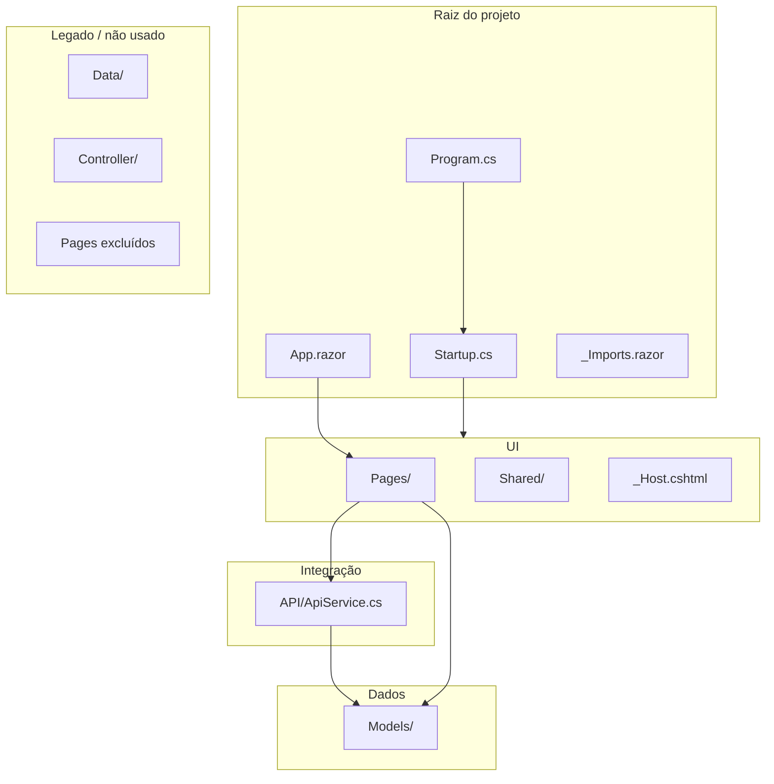

# Visão do codebase — ProCienciaWeb

Documento gerado na **Fase 3** do plano de execução. Descreve módulos, padrões de código, estado das funcionalidades, débitos técnicos priorizados e recomendações de limpeza — **sem alterar o código**.

**Referências:** [`inventario-tecnico.md`](./inventario-tecnico.md) · [`architecture.md`](./architecture.md) · [`PLANO-EXECUCAO-POR-FASES.md`](./PLANO-EXECUCAO-POR-FASES.md)  
**Data:** 2026-05-22

---

## 1. Resumo

O codebase é um **front-end Blazor Server enxuto**: poucas pastas, acoplamento direto entre páginas e `ApiService`, e resquícios do template inicial da Microsoft. O núcleo de negócio está em **três páginas** (`ListaProjetos`, `IncluirProjeto`, `EditarProjeto`); o restante é infraestrutura Blazor, DTOs ou código legado/não compilado.

---

## 2. Mapa de módulos



| Módulo / pasta | Arquivos principais | Responsabilidade |
|----------------|---------------------|------------------|
| **Raiz** | `Program.cs`, `Startup.cs`, `App.razor`, `_Imports.razor` | Host ASP.NET Core, DI, roteador Blazor, usings globais |
| **Pages/** | `ListaProjetos`, `IncluirProjeto`, `EditarProjeto`, `Index`, `Error`, `_Host` | Casos de uso e shell HTML |
| **Shared/** | `MainLayout`, `NavMenu`, `SurveyPrompt` | Layout e navegação |
| **API/** | `ApiService.cs` | Único cliente HTTP para API Azure |
| **Models/** | `Projeto`, `Area`, `SubArea`, `Instituicao` | DTOs JSON (sem validação/anotações) |
| **Data/** | `WeatherForecast`, `WeatherForecastService` | Template Blazor — **não usado** no fluxo de projetos |
| **Controller/** | `ProjetoController.cs` | Cópia parcial de `ApiService` — **excluído do build** |
| **wwwroot/** | CSS, Bootstrap, Open Iconic, favicon | Assets estáticos |
| **Properties/** | `launchSettings.json` | Perfis de execução local |
| **docs/** | Planos e inventários | Documentação (fora do runtime) |

---

## 3. Camadas lógicas

| Camada | Onde está | O que faz | O que não faz |
|--------|-----------|-----------|---------------|
| **Apresentação** | `Pages/*.razor`, `Shared/*` | Formulários, tabelas, navegação | Não chama HTTP diretamente (exceto via inject) |
| **Aplicação / integração** | `API/ApiService.cs` | Serialização e chamadas REST | Sem regras de negócio, sem cache, sem retry |
| **Modelo** | `Models/*.cs` | Estrutura de dados para JSON | Sem validação (`DataAnnotations`), sem EF |
| **Infraestrutura** | `Startup.cs`, `_Host.cshtml` | Pipeline, Blazor Hub, estáticos | Sem auth, sem logging estruturado de API |

Não há camada de **repositório**, **serviço de domínio** nem **ViewModel** — padrão típico de protótipo Blazor.

---

## 4. Padrões de código observados

### 4.1 Injeção de dependência

| Padrão | Uso | Exemplo |
|--------|-----|---------|
| `@inject ApiService` | Páginas de negócio | `ListaProjetos.razor`, `IncluirProjeto.razor` |
| `@inject NavigationManager` | Redirecionamento pós-salvar | `IncluirProjeto`, `EditarProjeto` |
| `AddSingleton<ApiService>()` | Registro em `Startup` | Uma instância por processo |

Serviços são resolvidos pelo container ASP.NET Core; páginas **não** recebem interfaces (`IApiService`), apenas a classe concreta.

### 4.2 Ciclo de vida Blazor

| Padrão | Onde | Observação |
|--------|------|------------|
| `OnInitializedAsync` | Todas as páginas de dados | Carrega listas/projeto na abertura |
| `@code { }` | Inline nas `.razor` | Sem code-behind separado (exceto legado `.cshtml`) |
| `[Parameter]` | `EditarProjeto` | `projetoId` da rota |

### 4.3 Coleções e dados

| Padrão | Uso | Motivo provável |
|--------|-----|-----------------|
| `ObservableCollection<T>` | Retorno de `ApiService` e estado das páginas | Compatibilidade com binding/listas mutáveis |
| `new ObservableCollection<>(lista.Where(...))` | Filtro em `ListaProjetos` | Refiltra em memória após GET completo |

### 4.4 Async/await

| Prática | Avaliação |
|---------|-----------|
| `await` em `OnInitializedAsync` e handlers de botão | Correto na maioria dos casos |
| `OnInitializedAsync().Wait()` em `FiltrarProjetos()` | **Anti-pattern** — bloqueia thread; causa warning CS1998 em métodos async vazios |
| `ExcluirProjeto` async sem corpo | Stub — warning CS1998 |
| `AlterarProjeto` async sem await real | Update comentado — navega sem persistir |

### 4.5 UI e formulários

| Padrão | Exemplo |
|--------|---------|
| Bootstrap 4 classes | `table`, `form-control`, `btn-primary` |
| `@bind` / `@bind-value` | Campos de texto em incluir/editar |
| `@bind:event="oninput"` | Filtro de pesquisa em lista |
| Links `<a href='/rota'>` | Navegação entre páginas (não `NavigationManager` em todos os casos) |
| `<select>` sem `@bind` | Subárea em incluir/editar — **gap funcional** |

### 4.6 Integração HTTP

| Padrão | Local | Problema conhecido |
|--------|-------|-------------------|
| URL base constante | `ApiService.UrlServico` | Sem configuração por ambiente |
| `HttpClient` estático | `ApiService.client` | Compartilhado globalmente |
| `JsonConvert.DeserializeObject` | Todos os GETs | Sem tratamento de null ou erro HTTP |
| `PostAsync` sem checar status | `IncluirProjeto` | Falhas silenciosas |

### 4.7 Convenções de nomenclatura

| Elemento | Convenção | Exemplos |
|----------|-----------|----------|
| Páginas | PascalCase + `.razor` | `ListaProjetos.razor` |
| Rotas | minúsculas, sem hífen | `/listaprojetos`, `/incluirprojeto` |
| Serviço injetado | `servicoProjeto` | camelCase em português |
| Modelos | PascalCase singular | `Projeto`, `SubArea` |
| API REST | Plural em inglês | `/api/Projetos` |

Comentários em português; mensagens de UI em português; código de template (`Error.razor`, `SurveyPrompt`) em inglês.

---

## 5. Funcionalidades × status

| ID | Funcionalidade | Página / módulo | Status | Notas |
|----|----------------|-----------------|--------|-------|
| F01 | Página inicial | `Index.razor` | OK | Estática |
| F02 | Listar projetos | `ListaProjetos` | OK | GET `/api/Projetos` |
| F03 | Filtrar por subárea (texto) | `ListaProjetos` | OK | Client-side; re-fetch via `.Wait()` |
| F04 | Navegar para incluir | `ListaProjetos` | OK | Link HTML |
| F05 | Incluir projeto | `IncluirProjeto` | Parcial | POST funciona; `SubAreaId` pode não ir no payload |
| F06 | Carregar subáreas no formulário | `IncluirProjeto`, `EditarProjeto` | OK | GET `/api/SubAreas` |
| F07 | Editar — carregar projeto | `EditarProjeto` | OK | GET `/api/Projetos/{id}` |
| F08 | Editar — salvar alterações | `EditarProjeto` | Ausente | `Update` comentado |
| F09 | Excluir projeto | `ListaProjetos` | Ausente | `ExcluirProjeto` vazio |
| F10 | Listar áreas | `ApiService` | Ausente na UI | Método existe, sem consumidor |
| F11 | Listar instituições | `ApiService` | Ausente na UI | Idem |
| F12 | Tratamento de erro de API | — | Ausente | Exceções não tratadas na UI |
| F13 | Autenticação / autorização | — | Ausente | Pipeline sem auth |
| F14 | Contador (template) | `Counter.razor` | Legado | Rota existe; menu comentado |

**Legenda:** OK = utilizável conforme esperado · Parcial = fluxo principal com lacunas · Ausente = não implementado · Legado = template sem uso de negócio

---

## 6. Débitos técnicos priorizados

| ID | Descrição | Prioridade | Impacto | Esforço | Arquivo(s) |
|----|-----------|------------|---------|---------|------------|
| DT-01 | Editar projeto não persiste (sem PUT/PATCH) | P0 | Alto — funcionalidade quebrada | M | `EditarProjeto.razor`, `ApiService.cs` |
| DT-02 | Excluir projeto não implementado | P0 | Alto | M | `ListaProjetos.razor`, `ApiService.cs` |
| DT-03 | Select de subárea sem `@bind` em `SubAreaId` | P0 | Alto — dados incorretos no POST | S | `IncluirProjeto.razor`, `EditarProjeto.razor` |
| DT-04 | .NET Core 3.1 EOL | P0 | Segurança / suporte | L | `ProCienciaWeb.csproj` |
| DT-05 | URL da API hardcoded | P1 | Médio — deploy multi-ambiente | S | `ApiService.cs`, `appsettings.json` |
| DT-06 | `HttpClient` estático | P1 | Médio — estabilidade sob carga | M | `ApiService.cs` |
| DT-07 | `FiltrarProjetos` usa `.Wait()` em async | P1 | Médio — deadlock/risco em Blazor | S | `ListaProjetos.razor` |
| DT-08 | Sem tratamento de erro HTTP / UX de falha | P1 | Médio | M | `ApiService.cs`, páginas |
| DT-09 | Filtro recarrega todos os projetos a cada tecla | P1 | Baixo/Médio — performance | M | `ListaProjetos.razor` |
| DT-10 | Duplicação `ProjetoController` vs `ApiService` | P2 | Baixo — confusão | S | `Controller/ProjetoController.cs` |
| DT-11 | Template Blazor (`WeatherForecast`, `Counter`, `SurveyPrompt`) | P2 | Baixo — ruído no repo | S | `Data/`, `Pages/Counter.razor`, `Shared/SurveyPrompt.razor` |
| DT-12 | `ObterAreas` / `ObterInstituicoes` sem UI | P2 | Baixo — código morto parcial | S | `ApiService.cs` |
| DT-13 | Sem testes automatizados | P1 | Médio — regressões | L | (novo projeto de testes) |
| DT-14 | Warnings CS1998 (async sem await) | P2 | Baixo | S | `ListaProjetos.razor`, `EditarProjeto.razor` |
| DT-15 | Parâmetro rota `projetoId` como `string` | P2 | Baixo — `Convert.ToInt32` manual | S | `EditarProjeto.razor` |

**Esforço:** S = horas · M = 1–2 dias · L = vários dias/semanas

---

## 7. Código morto e duplicação

### 7.1 Não compilado mas presente no disco

| Arquivo / pasta | Relação com código ativo | Ação recomendada |
|-----------------|--------------------------|------------------|
| `Controller/ProjetoController.cs` | Duplica `UrlServico`, `HttpClient`, `ObterProjetos` de `ApiService` | Remover pasta após confirmar que não há referências |
| `Pages/IncluirProjeto.cshtml` + `.cshtml.cs` | Substituído por `IncluirProjeto.razor` | Remover arquivos |
| `Pages/Component.razor` | Corpo vazio; `Content Remove` no csproj | Remover arquivo |

### 7.2 Compilado mas não usado no fluxo de negócio

| Item | Evidência | Ação recomendada |
|------|-----------|------------------|
| `WeatherForecastService` | Registrado em DI; nenhuma página injeta | Remover registro + arquivos `Data/` |
| `SurveyPrompt.razor` | Referência comentada em `Index.razor` | Remover componente |
| `Counter.razor` | Rota `/counter`; item de menu comentado | Remover ou documentar como demo |
| `ApiService.ObterAreas()` | Sem chamada nas páginas | Usar na UI ou remover até precisar |
| `ApiService.ObterInstituicoes()` | Idem | Idem |

### 7.3 Duplicação lógica

```text
ProjetoController.ObterProjetos()  ≈  ApiService.ObterProjetos()
         │                                    │
         └──────── mesma URL, mesmo HttpClient estático ────────┘
```

Formulários de **Incluir** e **Editar** duplicam markup (campos Titulo, Autor, Telefone, Email, SubArea, Resumo) — candidato a componente compartilhado `FormularioProjeto.razor` (refatoração futura, não nesta fase).

---

## 8. Análise por página de negócio

### 8.1 `ListaProjetos.razor`

| Aspecto | Detalhe |
|---------|---------|
| Responsabilidade | Listagem, filtro, links editar/incluir, botão excluir |
| Dependências | `@inject ApiService` |
| Pontos fortes | Fluxo de listagem simples e legível |
| Pontos fracos | `FiltrarProjetos().Wait()`; excluir vazio; possível `NullReference` se `SubArea` for null na API |

### 8.2 `IncluirProjeto.razor`

| Aspecto | Detalhe |
|---------|---------|
| Responsabilidade | Formulário de criação + POST |
| Pontos fortes | `SalvarProjeto` async com navegação pós-sucesso |
| Pontos fracos | Select de subárea só exibe `@subArea.Nome` sem bind de id |

### 8.3 `EditarProjeto.razor`

| Aspecto | Detalhe |
|---------|---------|
| Responsabilidade | Carregar e exibir formulário de edição |
| Pontos fortes | Usa parâmetro de rota e `ObterProjeto` |
| Pontos fracos | `AlterarProjeto` não chama API; mesmo problema de select que incluir |

---

## 9. Recomendações de limpeza (sem implementar agora)

Ordem sugerida para uma futura sprint de higiene — **apenas documentação nesta fase**:

1. **P0 funcional:** implementar update/delete e bind de `SubAreaId` antes de remover legado.
2. **Remover do repositório:** `Controller/`, `IncluirProjeto.cshtml*`, `Component.razor`.
3. **Remover template:** `Data/WeatherForecast*`, `Counter.razor`, `SurveyPrompt.razor`; retirar `AddSingleton<WeatherForecastService>`.
4. **Consolidar cliente HTTP:** manter só `ApiService`; eliminar duplicata mental do controller.
5. **Opcional:** extrair `FormularioProjeto.razor` para DRY entre incluir/editar.
6. **Pacote dev:** avaliar remoção de `Microsoft.VisualStudio.Web.CodeGeneration.Design` se scaffolding não for mais usado.

---

## 10. Matriz rápida: onde alterar o quê

| Se você precisa… | Olhe primeiro em… |
|------------------|-------------------|
| Mudar URL da API | `API/ApiService.cs` |
| Novo endpoint REST | `API/ApiService.cs` + página que injeta serviço |
| Nova rota UI | Nova `Pages/*.razor` com `@page` + `NavMenu.razor` |
| Novo campo no formulário | `Models/Projeto.cs` + `IncluirProjeto` / `EditarProjeto` |
| Registrar serviço | `Startup.cs` → `ConfigureServices` |
| Layout / menu | `Shared/MainLayout.razor`, `Shared/NavMenu.razor` |
| Erro global | `Pages/Error.razor`, `Startup` exception handler |

---

## 11. Referências cruzadas

| Documento | Conteúdo relacionado |
|-----------|----------------------|
| [`inventario-tecnico.md`](./inventario-tecnico.md) | Rotas, pacotes, tabela ApiService, exclusões csproj |
| [`architecture.md`](./architecture.md) | C4, sequências, riscos arquiteturais |
| [`PLANO-EXECUCAO-POR-FASES.md`](./PLANO-EXECUCAO-POR-FASES.md) | Fases 4–8 (setup, PRD, TDD, testes) |

**Próxima fase:** Fase 4 — `docs/setup-local.md` (clone, build, run, troubleshooting).
