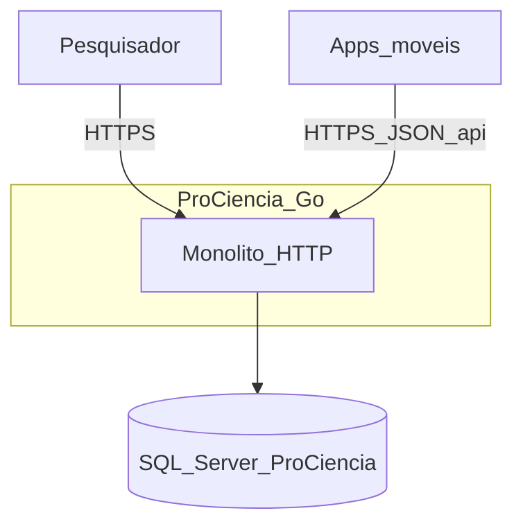
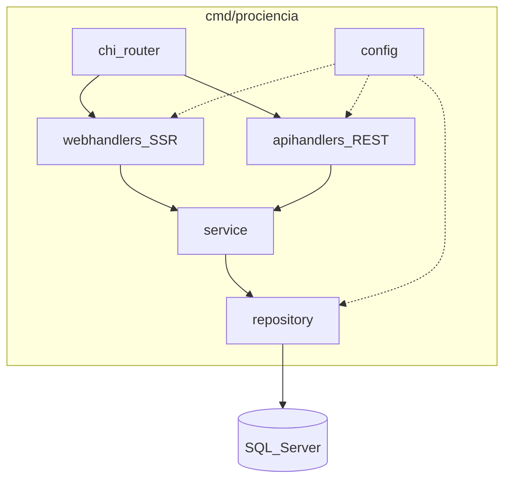
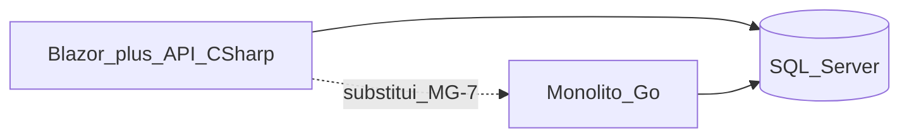

# TDD — Arquitetura Go ProCiencia (migração)

| Campo | Valor |
|-------|--------|
| Tech Lead | @Elienaldo |
| Equipe | Migração Go (agente + mantenedor) |
| Epic / Plano | [PLANO-MIGRACAO-GO.md](../PLANO-MIGRACAO-GO.md) — MG-2 |
| Status | **Aprovado para implementação** (MG-3+) |
| Criado | 2026-05-30 |
| Atualizado | 2026-05-30 |

**Referências:** [PRD.md](../PRD.md) · [architecture.md legado](../architecture.md) · [inventario-api-legado.md](./inventario-api-legado.md) · [ADR](./adr/README.md)

---

## Contexto

O ecossistema Pró Ciência hoje separa **ProCienciaWeb** (Blazor Server, cliente fino) e **ServicoProCiencia** (ASP.NET Core 3.1, API REST em Azure). A MG-1 inventariou **20 rotas REST** sem autenticação, persistência SQL Server e gaps de paridade (front só GET/POST em Projetos; API com CRUD completo).

Este TDD congela a arquitetura do **monólito modular Go** que substituirá ambos no mesmo repositório: **SSR** para o navegador e **REST `/api/*`** para apps móveis, reutilizando o banco `ProCiencia` e o contrato JSON camelCase documentado no inventário.

**Domínio:** cadastro e gestão de **projetos científicos**, com taxonomia **Área → Subárea** e cadastro auxiliar de **instituições**.

**Stakeholders:** pesquisadores (web), apps móveis (API estável), operação Azure (cutover MG-7).

---

## Definição do problema e motivação

### Problemas

- **Stack legada em fim de vida:** .NET Core 3.1 e EF Core preview aumentam risco de segurança e manutenção.
- **Duplo deploy e latência:** Blazor chama API remota; edição/exclusão não implementadas no front apesar de existirem na API.
- **Schema implícito:** sem migrations versionadas no repo C#; API Azure com HTTP 500 sugere falha operacional de banco.

### Por que agora

Plano de migração MG-0/MG-1 concluídos; inventário permite implementar paridade em Go sem adivinhar rotas.

### Impacto de não migrar

Dívida técnica, indisponibilidade da API em produção e impossibilidade de fechar backlog Must (BL-001…005) de forma sustentável.

---

## Escopo

### Em escopo (V1 — MG-3 … MG-5)

- Módulo Go `github.com/Elienaldo/prociencia` na raiz do repositório.
- Pacotes `cmd/prociencia` + `internal/*` conforme tabela abaixo.
- REST `/api/Projetos`, `/api/Areas`, `/api/SubAreas`, `/api/Instituicoes` — paridade com [inventario-api-legado.md](./inventario-api-legado.md) §4.1.
- Web SSR: `/`, `/listaprojetos`, `/incluirprojeto`, `/editarprojeto/{id}` com BL-001…005 do PRD.
- SQL Server via `database/sql` + go-mssqldb; migrations baseline em `migrations/`.
- Configuração por variáveis de ambiente (sem secrets no Git).
- Logging estruturado com `slog`.

### Fora de escopo (V1)

- Autenticação/autorização (RF-017) — fase posterior; API permanece pública como legado até decisão de produto.
- Microserviços, filas, cache distribuído.
- Troca de SGBD (PostgreSQL).
- Reescrita de apps móveis.
- Hospedagem final detalhada (documento `deploy.md` na MG-7).

### Considerações futuras (V2+)

- JWT ou API keys em `/api/*` com versionamento.
- OpenAPI publicado pelo binário Go.
- Paginação e filtros server-side na listagem.

---

## Solução técnica

### Visão geral

Monólito modular: um processo HTTP serve HTML e JSON. **Regras de negócio** vivem em `internal/service`; **persistência** em `internal/repository`; **contratos HTTP** em `apihandlers` e `webhandlers`.

Decisões detalhadas: [docs/go/adr/](./adr/README.md).

### Diagrama C4 — Contexto

### Diagrama C4 — Containers (processo único)

### Fluxo de dados

1. **Móvel:** `GET /api/Projetos` → `apihandlers` → `service` → `repository` → SQL (JOINs para `area`/`subArea` na lista).
2. **Web:** `GET /listaprojetos` → `webhandlers` → `service` (mesmo método que API) → template HTML.
3. **Escrita:** `POST /incluirprojeto` → validação em `service` → `repository` → redirect; paralelamente `POST /api/Projetos` para clientes REST.

### Módulo Go

| Item | Valor |
|------|--------|
| **Module path** | `github.com/Elienaldo/prociencia` |
| **Go version** | 1.22+ |
| **Entrypoint** | `cmd/prociencia/main.go` |

### Tabela pacote → responsabilidade

| Pacote | Responsabilidade | Depende de |
|--------|------------------|------------|
| `cmd/prociencia` | `main`, wiring, graceful shutdown, montagem chi | `config`, handlers, `service` |
| `internal/config` | Env: `DATABASE_URL`, `HTTP_ADDR`, `LOG_LEVEL`; validação na subida | — |
| `internal/domain` | Structs `Projeto`, `Area`, `SubArea`, `Instituicao` (sem tags de framework) | — |
| `internal/repository` | SQL parametrizado, mapeamento rows → domain | `domain`, `database/sql` |
| `internal/service` | Validação BL-001…005, orquestração, erros de negócio | `domain`, interfaces de repo |
| `internal/apihandlers` | REST `/api/*`, JSON camelCase, códigos HTTP de paridade | `service` |
| `internal/webhandlers` | SSR `html/template`, formulários, flash/erros UI | `service`, templates em `web/` |
| `web/templates` | Layout, listagem, incluir, editar | — |
| `web/static` | CSS, assets (embed) | — |
| `migrations/` | SQL versionado golang-migrate | — |

**Regra de dependência:** `domain` não importa outros `internal/*`. `service` não importa `apihandlers` nem `webhandlers`. Handlers não importam `repository` diretamente.

### Contrato REST `/api/*` (congelado)

| Regra | Detalhe |
|-------|---------|
| **Paths** | Exatamente como legado: `/api/Projetos`, `/api/Areas`, `/api/SubAreas`, `/api/Instituicoes` (PascalCase do controller ASP.NET). |
| **JSON** | Propriedades **camelCase** (`projetoId`, `titulo`, …). |
| **Verbos** | CRUD completo por entidade (matriz no inventário). |
| **Includes** | `GET` lista `Projetos` e `SubAreas` com objetos aninhados `area`/`subArea` quando aplicável; `GET` por id sem include (paridade legado). |
| **Breaking change** | Exige novo prefixo (`/api/v2/...`) ou acordo explícito com consumidores móveis; não alterar semântica de campos existentes. |
| **Auth** | Nenhuma na V1 (paridade). |

Códigos HTTP: preferir comportamento do **código C#** documentado no inventário (ex.: PUT → 204, DELETE → 200 com corpo) para minimizar surpresas; divergências Swagger legado são aceitas se documentadas em testes de contrato (MG-6).

### Mapeamento PRD / backlog → pacotes Go

| ID | Requisito / item | Pacote principal | Notas |
|----|------------------|------------------|-------|
| RF-001, RF-002 | Listagem e filtro | `webhandlers`, `service` | Filtro subárea pode ser server-side ou template (R2) |
| RF-003…006 | Inclusão | `webhandlers`, `service`, `repository` | BL-004 validação POST |
| RF-007, RF-008 | Edição | `webhandlers`, `service` | BL-002 PUT paridade API |
| RF-009, RF-014 | Exclusão + confirmação | `webhandlers` | BL-003, BL-005 |
| RF-004, RF-010, RF-015 | Subáreas / cascata | `webhandlers`, `service` | BL-001, BL-012 |
| RF-011, RF-012, RF-013 | UX, erros, nav | `web/templates`, `webhandlers` | BL-006, BL-013 |
| RF-017 | Auth | — | V2 |
| BL-001…005 | Must MVP | `service` + `webhandlers` | Critério MG-5 |
| API móvel CRUD | Paridade 4 entidades | `apihandlers`, `service`, `repository` | MG-4 |

### Configuração (variáveis de ambiente)

| Variável | Obrigatória | Default | Uso |
|----------|-------------|---------|-----|
| `DATABASE_URL` | Sim (prod) | — | Connection string SQL Server (`sqlserver://…` ou formato ADO aceito pelo driver) |
| `HTTP_ADDR` | Não | `:8080` | Bind do servidor |
| `LOG_LEVEL` | Não | `info` | `debug`, `info`, `warn`, `error` para `slog` |

Secrets **nunca** no Git; App Service / CI injetam `DATABASE_URL`.

### Estratégia de dados

| Aspecto | Decisão |
|---------|---------|
| **Banco V1** | Mesmo SQL Server e tabelas legadas (`Projeto`, `Area`, `SubArea`, `Instituicao`) |
| **Migração de dados** | **Não** há ETL entre SGBDs; cutover aponta o mesmo banco (ou réplica) para o binário Go |
| **Migrations Go** | Baseline `000001` descreve schema existente; em DB já populado, aplicar [stamp baseline](./adr/003-database-migrations.md) sem DROP |
| **Novos campos** | Somente via migrations `.up.sql` após MG-4, com `.down.sql` testado |
| **Validação MG-4** | Confirmar nomes de tabela/coluna com `MSSQL_CONNECTION_STRING` (MCP ou SSMS) |

### Dependências principais (runtime)

| Dependência | Papel |
|-------------|--------|
| `github.com/go-chi/chi/v5` | Router HTTP |
| `github.com/microsoft/go-mssqldb` | Driver SQL Server |
| `github.com/golang-migrate/migrate/v4` | CLI migrations (não link obrigatório no binário da app) |

---

## Riscos

| Risco | Impacto | Prob. | Mitigação |
|-------|---------|-------|-----------|
| Schema real ≠ inferido MG-1 | Alto | Média | Validar DDL na MG-4; ajustar repository e baseline migration |
| Breaking JSON para móveis | Alto | Baixa | Testes de contrato; política de versão `/api/v2` |
| API pública sem auth | Alto | Alta (legado) | Documentar; RF-017 em fase posterior |
| Monólito in-process mascara bug só na API | Médio | Média | Testes HTTP em `apihandlers` (MG-6) |
| Cutover Azure com downtime | Médio | Média | Strangler + rollback MG-7; healthcheck antes de trocar tráfego |
| EF legado vs SQL manual divergente | Médio | Média | Comparar respostas .NET vs Go em staging |

---

## Plano de implementação

Alinhado às fases MG do [PLANO-MIGRACAO-GO.md](../PLANO-MIGRACAO-GO.md):

| Fase | Entregável | Foco |
|------|------------|------|
| **MG-3** | `go.mod`, `cmd/prociencia`, `GET /health` | Wiring chi, config, slog |
| **MG-4** | `apihandlers` + `repository` + `service` + migrations baseline | Paridade REST |
| **MG-5** | `webhandlers` + templates | BL-001…005, rotas SSR |
| **MG-6** | Testes Go + Playwright | Contrato API, fluxos web |
| **MG-7** | `deploy.md`, `legacy/dotnet/` | Cutover Azure, rollback |

---

## Considerações de segurança

- **V1:** sem autenticação (paridade legado) — adequado apenas para ambientes controlados; não expor escrita em produção pública sem plano RF-017.
- **Input:** validar tamanho e formato (e-mail, IDs) em `service`; SQL sempre parametrizado.
- **Headers:** `Content-Security-Policy` básico nas páginas SSR na MG-5; HTTPS obrigatório em produção.
- **Logs:** não registrar `DATABASE_URL` nem PII desnecessária.

---

## Estratégia de testes

| Tipo | Escopo | Meta |
|------|--------|------|
| **Unit** | `service` (validações BL-*) | Casos Must cobertos |
| **Integration** | `repository` + SQL Server (testcontainers ou instância local) | CRUD por entidade |
| **HTTP** | `apihandlers` | Status e JSON vs inventário |
| **E2E** | Playwright (MG-6) | Listar, incluir, editar, excluir com confirmação |

---

## Monitoramento e observabilidade

| Métrica / sinal | Uso |
|-----------------|-----|
| `GET /health` | Liveness (MG-3); incluir ping DB opcional na MG-4 |
| Logs JSON (`slog`) | request_id, method, path, status, duration_ms |
| Taxa 5xx em `/api/*` | Alerta pós-cutover |
| Latência p95 | Comparar Go vs legado em staging |

Ferramenta Azure (App Insights / Log Analytics) na MG-7.

---

## Plano de rollback

### Estratégia de deploy (MG-7)

**Strangler Fig / blue-green simplificado:** manter App Service .NET até Go estável; alternar slot ou DNS para o binário Go.

| Fase | Ação |
|------|------|
| Preparação | Backup DB; deploy Go em slot staging; smoke tests `/health` e `/api/Projetos` |
| Piloto | % tráfego ou uso interno apenas |
| Cutover | Trocar connection string / site para Go |
| Rollback | Reverter slot para .NET; DB só se migration destrutiva (evitar na V1) |

### Gatilhos de rollback

| Gatilho | Ação |
|---------|------|
| 5xx > 5% em `/api/*` por 5 min | Reverter para .NET |
| Falha crítica em escrita de projetos | Reverter + incidente |
| Migration falhou em prod | **Não** cutover; restaurar backup se necessário |

### Dados

V1 não altera schema em produção no cutover inicial → rollback de app **sem** rollback de dados. Migrations pós-cutover exigem `.down.sql` testado.

---

## Plano de migração (sistema)

| Etapa | Descrição |
|-------|-----------|
| 1 | Congelar .NET (MG-0) — feito |
| 2 | Inventariar API (MG-1) — feito |
| 3 | Arquitetura (MG-2) — este documento |
| 4 | Scaffold + API + Web (MG-3–5) |
| 5 | Testes e cutover (MG-6–7) |
| 6 | Mover .NET para `legacy/dotnet/` (MG-7) |

---

## Alternativas consideradas

| Alternativa | Motivo de rejeição |
|-------------|-------------------|
| Manter Blazor + só reescrever API | Não atinge stack única Go; duplo deploy permanece |
| Microserviços web + API | Complexidade desnecessária para o tamanho do domínio |
| PostgreSQL | Breaking para Azure e dados existentes |
| Loopback HTTP web→api | Ver [ADR-004](./adr/004-web-in-process-monolith.md) |

---

## Questões em aberto

| # | Questão | Owner | Status |
|---|---------|-------|--------|
| 1 | Nomes exatos de tabelas/colunas no Azure | MG-4 + MCP MSSQL | Aberto |
| 2 | Commit exato do deploy Azure vs GitHub | MG-7 | Aberto |
| 3 | Política de auth móvel (RF-017) | Produto | V2 |

---

## Validação crítica (the-fool — pré-mortem)

Stress-test antes de congelar MG-2; mitigações incorporadas acima.

| Desafio | Mitigação no desenho |
|---------|----------------------|
| “Schema inferido está errado” | Baseline migration + validação MG-4; não DROP em prod |
| “Monólito esconde bugs da API” | Testes HTTP dedicados em `apihandlers` |
| “Sem auth = incidente” | Documentado; RF-017 explícito fora de V1 |
| “PascalCase em paths é estranho em Go” | **Congelado** por contrato móvel — não “corrigir” para kebab-case |
| “Cutover quebra móveis” | Paridade inventário + rollback para .NET |

---

## Glossário

| Termo | Significado |
|-------|-------------|
| **Projeto** | Registro de projeto científico (título, autor, subárea, …) |
| **Paridade** | Comportamento equivalente ao legado documentado no inventário |
| **Strangler Fig** | Substituir gradualmente o legado pelo novo sistema |

---

## Aprovação

| Papel | Status | Data |
|-------|--------|------|
| MG-2 DoD | Completo | 2026-05-30 |
| Revisão humana | Pendente | — |

**Próximo passo:** [MG-3](../PLANO-MIGRACAO-GO.md) — scaffold `go.mod` e `GET /health`.
