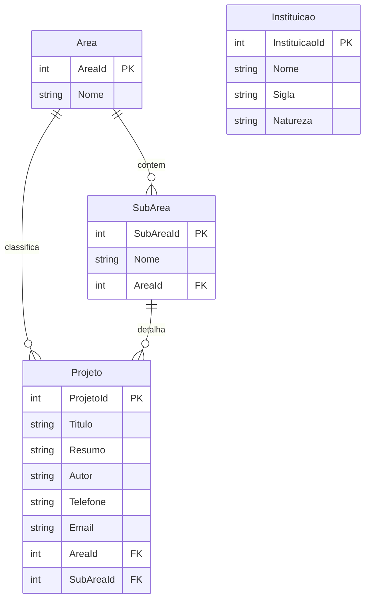

# Inventário da API legada — ServicoProCiencia

**Fase:** MG-1 do [PLANO-MIGRACAO-GO.md](../PLANO-MIGRACAO-GO.md)  
**Data:** 2026-05-30  
**Repositório analisado:** [github.com/Elienaldo/ServicoProCiencia](https://github.com/Elienaldo/ServicoProCiencia) (branch `main`, commit `af0c638`)  
**API em produção:** `https://apiprociencia.azurewebsites.net`  
**Referência front:** [architecture.md](../architecture.md) §9 · [inventario-tecnico.md](../inventario-tecnico.md) §9

---

## 1. Resumo executivo

| Item | Valor |
|------|--------|
| **Stack API** | ASP.NET Core **3.1** (`netcoreapp3.1`), Web API + Swagger UI na raiz |
| **Persistência** | **EF Core 5.0 preview** + **SQL Server** (`UseSqlServer`) |
| **Autenticação** | **Nenhuma** (`UseAuthorization` comentado; sem `[Authorize]`) |
| **Controllers de domínio** | `Projetos`, `Areas`, `SubAreas`, `Instituicoes` |
| **Padrão REST** | Scaffold CRUD completo por entidade (GET lista, GET id, POST, PUT, DELETE) |
| **Migrations EF** | **Não há** pasta `Migrations/` no repositório — schema inferido dos models |
| **Estado Azure (2026-05-30)** | Swagger **200**; endpoints `/api/*` retornam **500** (provável falha de conexão com SQL no App Service) |

Este documento é a especificação de paridade para **MG-4** (handlers Go) e contrato estável para **apps móveis**.

---

## 2. Repositório e dependências

### 2.1 Estrutura

```
ServicoProCiencia/
├── ServicoProCiencia.sln
└── ServicoProCiencia/
    ├── Controllers/     # Projetos, Areas, SubAreas, Instituicoes (+ WeatherForecast excluído do build)
    ├── Contexto/        # ProCienciaContext.cs
    ├── Models/          # ProCiencia.Models
    ├── Startup.cs
    ├── Program.cs
    └── appsettings.json
```

### 2.2 Pacotes NuGet (`ServicoProCiencia.csproj`)

| Pacote | Versão | Uso |
|--------|--------|-----|
| `Microsoft.NET.Sdk.Web` | — | Host ASP.NET Core 3.1 |
| `Microsoft.EntityFrameworkCore.SqlServer` | 5.0.0-**preview**.3.20181.2 | SQL Server |
| `Microsoft.EntityFrameworkCore.Tools` | 5.0.0-preview.3.20181.2 | Ferramentas EF (migrations não versionadas no repo) |
| `Microsoft.EntityFrameworkCore.Sqlite` | 5.0.0-preview.3.20181.2 | Referenciado; **não usado** em `Startup` |
| `EntityFramework` | 6.4.4 | Legado EF6 (referência residual) |
| `Swashbuckle.AspNetCore` | 5.4.1 | OpenAPI / Swagger UI |
| `Microsoft.VisualStudio.Web.CodeGeneration.Design` | 3.1.1 | Scaffolding |

**Risco:** EF Core em versão **preview** e mistura de namespaces EF6 (`System.Data.Entity.ModelConfiguration.Conventions`) em `ProCienciaContext` — convenções podem não se aplicar como esperado no EF Core.

### 2.3 Configuração local (`appsettings.json`)

| Chave | Valor (exemplo no repo — **não commitar secrets em outros ambientes**) |
|-------|---------------------------------------------------------------------------|
| `ConnectionStrings:ProCienciaContext` | `Server=PC-ELIENALDO\SQLEXPRESS;Initial Catalog=ProCiencia;Integrated Security=True` |

Banco alvo: **`ProCiencia`** em SQL Server. Connection string de **Azure** não está no Git (configurada no App Service).

---

## 3. Autenticação e autorização

| Aspecto | Implementação |
|---------|----------------|
| JWT / API Key / cookies | **Ausente** |
| `UseAuthentication` | **Não registrado** |
| `UseAuthorization` | **Comentado** em `Startup.cs` |
| Swagger `security` | **Indefinido** (sem esquemas de segurança) |
| CORS | Não configurado explicitamente no código analisado |

**Implicação para Go:** manter endpoints públicos na paridade inicial ou introduzir auth em fase posterior com coordenação dos apps móveis.

---

## 4. Endpoints REST

**Base URL:** `https://apiprociencia.azurewebsites.net`  
**Prefixo:** `api/[controller]` → pluralização do nome do controller (`Projetos`, `Areas`, `SubAreas`, `Instituicoes`).

**Content-Type:** `application/json` (serialização ASP.NET Core — propriedades em **camelCase** no Swagger; clientes Newtonsoft no front costumam deserializar de forma case-insensitive).

### 4.1 Matriz completa (código + Swagger Azure)

| Recurso | Verbo | Path | Request body | Response sucesso (código) | Corpo resposta | Include / notas |
|---------|-------|------|--------------|----------------------------|----------------|-----------------|
| **Projetos** | GET | `/api/Projetos` | — | 200 | `Projeto[]` | `Include(Area)`, `Include(SubArea)` |
| **Projetos** | GET | `/api/Projetos/{id}` | — | 200 / 404 | `Projeto` | **Sem** `Include` — só `FindAsync` |
| **Projetos** | POST | `/api/Projetos` | `Projeto` | 201 (código) / 200 (Swagger) | `Projeto` criado | `CreatedAtAction` no código |
| **Projetos** | PUT | `/api/Projetos/{id}` | `Projeto` | 204 No Content (código) / 200 (Swagger) | vazio | Valida `id == projeto.ProjetoId` |
| **Projetos** | DELETE | `/api/Projetos/{id}` | — | 200 + corpo (código/Swagger) | `Projeto` removido | Retorna entidade deletada |
| **Areas** | GET | `/api/Areas` | — | 200 | `Area[]` | Lista simples |
| **Areas** | GET | `/api/Areas/{id}` | — | 200 / 404 | `Area` | |
| **Areas** | POST | `/api/Areas` | `Area` | 201 / 200 | `Area` | |
| **Areas** | PUT | `/api/Areas/{id}` | `Area` | 204 / 200 | — | |
| **Areas** | DELETE | `/api/Areas/{id}` | — | 200 | `Area` | |
| **SubAreas** | GET | `/api/SubAreas` | — | 200 | `SubArea[]` | `Include(Area)` |
| **SubAreas** | GET | `/api/SubAreas/{id}` | — | 200 / 404 | `SubArea` | Sem include no GET por id |
| **SubAreas** | POST | `/api/SubAreas` | `SubArea` | 201 / 200 | `SubArea` | |
| **SubAreas** | PUT | `/api/SubAreas/{id}` | `SubArea` | 204 / 200 | — | |
| **SubAreas** | DELETE | `/api/SubAreas/{id}` | — | 200 | `SubArea` | |
| **Instituicoes** | GET | `/api/Instituicoes` | — | 200 | `Instituicao[]` | |
| **Instituicoes** | GET | `/api/Instituicoes/{id}` | — | 200 / 404 | `Instituicao` | |
| **Instituicoes** | POST | `/api/Instituicoes` | `Instituicao` | 201 / 200 | `Instituicao` | |
| **Instituicoes** | PUT | `/api/Instituicoes/{id}` | `Instituicao` | 204 / 200 | — | |
| **Instituicoes** | DELETE | `/api/Instituicoes/{id}` | — | 200 | `Instituicao` | |

**Erros comuns:** `400 Bad Request` (id do path ≠ id do body no PUT); `404 Not Found` (recurso inexistente).

### 4.2 Contrato consumido pelo ProCienciaWeb (`ApiService`)

Comparado com [architecture.md](../architecture.md) §9:

| Verbo | Endpoint | No `ApiService` | Gap |
|-------|----------|-----------------|-----|
| GET | `/api/Projetos` | Sim | — |
| GET | `/api/Projetos/{id}` | Sim | — |
| POST | `/api/Projetos/` (barra final) | Sim | API aceita `/api/Projetos` sem barra |
| PUT | `/api/Projetos/{id}` | **Não** | Edição não persiste no front |
| DELETE | `/api/Projetos/{id}` | **Não** | Exclusão não implementada no front |
| GET | `/api/Areas` | Sim (não usado em páginas) | — |
| GET | `/api/SubAreas` | Sim | — |
| GET | `/api/Instituicoes` | Sim (não usado em páginas) | — |

**Mínimo para MG-4 (paridade API):** implementar em Go todos os verbos da matriz §4.1 para as quatro entidades, mesmo que o front atual só use um subconjunto.

### 4.3 OpenAPI (Azure)

- URL: `https://apiprociencia.azurewebsites.net/swagger/v1/swagger.json`
- Título: **API Pró Ciência** v1
- Schemas: `Projeto`, `Area`, `SubArea`, `Instituicao`
- **Divergência código vs Swagger:** códigos HTTP de POST/PUT (201/204 no código vs 200 no Swagger exportado)

---

## 5. Modelos de domínio (API)

Namespace: `ProCiencia.Models` (idêntico em espírito aos DTOs em `ProCienciaWeb/Models/`).

### 5.1 `Projeto`

| Propriedade | Tipo C# | JSON (Swagger) | Obrigatório negócio | Observação |
|-------------|---------|----------------|---------------------|------------|
| `ProjetoId` | int | `projetoId` | PK | Identity no SQL |
| `Titulo` | string | `titulo` | Sim | |
| `Resumo` | string | `resumo` | | |
| `Autor` | string | `autor` | | |
| `Telefone` | string | `telefone` | | |
| `Email` | string | `email` | | |
| `AreaId` | int | `areaId` | FK | |
| `SubAreaId` | int | `subAreaId` | FK | Front pode enviar `0` se select sem bind |
| `Area` | `Area` | `area` | Nav | Preenchido no GET lista |
| `SubArea` | `SubArea` | `subArea` | Nav | Preenchido no GET lista |

### 5.2 `Area`

| Propriedade | Tipo | JSON |
|-------------|------|------|
| `AreaId` | int | `areaId` |
| `Nome` | string | `nome` |

### 5.3 `SubArea`

| Propriedade | Tipo | JSON |
|-------------|------|------|
| `SubAreaId` | int | `subAreaId` |
| `Nome` | string | `nome` |
| `AreaId` | int | `areaId` |
| `Area` | `Area` | `area` |

### 5.4 `Instituicao`

| Propriedade | Tipo | JSON |
|-------------|------|------|
| `InstituicaoId` | int | `instituicaoId` |
| `Nome` | string | `nome` |
| `Sigla` | string | `sigla` |
| `Natureza` | string | `natureza` |

**Nota:** `Instituicao` existe no `DbContext` mas **não há FK** para `Projeto` no model — entidade de lookup independente (apps móveis podem usá-la).

---

## 6. Persistência e schema SQL

### 6.1 `ProCienciaContext`

```csharp
DbSet<Instituicao> Instituicao
DbSet<Area> Area
DbSet<SubArea> SubArea
DbSet<Projeto> Projeto
```

`OnModelCreating`: tentativa de desabilitar cascade delete via convenções EF6; sem `Fluent API` explícita para tabelas/FKs.

### 6.2 Schema inferido (EF Core — sem migrations no repo)

Nomes de tabela prováveis: **iguais ao nome da entidade** (`Projeto`, `Area`, `SubArea`, `Instituicao`) — confirmar no banco real na MG-4.

| Tabela | Colunas | FK |
|--------|---------|-----|
| `Area` | `AreaId` (PK), `Nome` | — |
| `SubArea` | `SubAreaId` (PK), `Nome`, `AreaId` | → `Area.AreaId` |
| `Projeto` | `ProjetoId` (PK), `Titulo`, `Resumo`, `Autor`, `Telefone`, `Email`, `AreaId`, `SubAreaId` | → `Area`, → `SubArea` |
| `Instituicao` | `InstituicaoId` (PK), `Nome`, `Sigla`, `Natureza` | — |

### 6.3 Diagrama ER



### 6.4 Validações no servidor

| Tipo | Presente? |
|------|-------------|
| DataAnnotations nos models | **Não** |
| FluentValidation | **Não** |
| Filtros globais de validação | **Não** |
| Regras em controllers | Apenas checagem `id` vs body no PUT |

Validação de negócio deve ser **reimplementada em Go** (`internal/service`) com base no [PRD.md](../PRD.md) (BL-001…005).

---

## 7. Azure vs código local

| Aspecto | Código GitHub (`ServicoProCiencia`) | Azure `apiprociencia.azurewebsites.net` |
|---------|--------------------------------------|----------------------------------------|
| Rotas `/api/*` | 4 controllers CRUD | Swagger lista **mesmas 8 paths** |
| Swagger UI | Configurado (`RoutePrefix = ""`) | **OK** (`/` → UI) |
| Dados `/api/Projetos` etc. | Depende do SQL local | **HTTP 500** em todos os GET testados (2026-05-30) |
| Connection string | `appsettings.json` (dev local) | App Settings Azure (**não no repo**) |
| Versão EF / runtime | 3.1 + EF preview | Presumido deploy do mesmo código (não verificado commit exato) |

**Hipótese do 500:** connection string inválida, SQL inacessível do App Service, firewall Azure, ou banco `ProCiencia` não provisionado no servidor cloud.

**Ação MG-4:** validar schema com `MSSQL_CONNECTION_STRING` local ou Docker SQL Server; não depender da API Azure até corrigir infra.

---

## 8. Riscos de paridade (Go / móveis)

| ID | Risco | Impacto | Mitigação |
|----|-------|---------|-----------|
| P1 | GET `/api/Projetos/{id}` sem `Area`/`SubArea` | Edição web pode precisar de joins extras | Go: `Include` equivalente em queries |
| P2 | JSON **camelCase** vs tags Go | Desserialização móvel | Tags `json:"projetoId"` alinhadas ao Swagger |
| P3 | Códigos HTTP POST/PUT/DELETE divergentes no Swagger | Clientes rígidos | Aceitar 200/201/204 conforme implementação real |
| P4 | Sem migrations versionadas | Schema drift | Exportar script DDL na MG-4 (`migrations/`) |
| P5 | `Instituicao` sem vínculo com `Projeto` | Requisitos futuros de instituição no projeto | Confirmar com produto antes de adicionar FK |
| P6 | API Azure indisponível (500) | Bloqueio de testes de contrato contra prod | Testes contra Go local + DB dev |
| P7 | EF Core preview + pacotes antigos | Comportamento inconsistente | Não portar bugs; testes de contrato em Go |
| P8 | Sem auth | Segurança | ADR na MG-2; opcional API key depois |
| P9 | Front POST com `SubAreaId = 0` | Dados inválidos no banco | Validação no `service` Go |

---

## 9. Apps móveis — contrato estável

Manter para **AppProCiencia** / **ProCienciaApp**:

1. Prefixo `/api/` e nomes de controller no plural (`Projetos`, `Areas`, `SubAreas`, `Instituicoes`).
2. Payload JSON com propriedades em **camelCase** (compatível com Swagger atual).
3. CRUD completo em **Projetos** (já exposto pela API legada).
4. Lookups: **Areas**, **SubAreas** (com `area` aninhado na lista), **Instituicoes**.
5. Breaking changes exigem versão (`/api/v2/...`) — ver MG-2.

---

## 10. MCP SQL Server (MG-1)

| Decisão | Detalhe |
|---------|---------|
| **MCP MSSQL** | Entrada **documentada** em `.cursor/mcp.json` (raiz); **não habilitado** até existir `MSSQL_CONNECTION_STRING` no ambiente do desenvolvedor |
| **Schema nesta fase** | Inferido de models + `ProCienciaContext` (sem introspecção live) |
| **Scripts manuais (MG-4)** | `SELECT TABLE_NAME FROM INFORMATION_SCHEMA.TABLES` e `sp_help` quando houver DB |

Exemplo de configuração (sem secret no Git):

```json
"MSSQL": {
  "command": "npx",
  "args": ["-y", "@modelcontextprotocol/server-mssql"],
  "env": {
    "MSSQL_CONNECTION_STRING": "${env:MSSQL_CONNECTION_STRING}"
  }
}
```

---

## 11. Referências de código (ServicoProCiencia)

| Artefato | Caminho no repo |
|----------|-----------------|
| Projetos CRUD | `ServicoProCiencia/Controllers/ProjetosController.cs` |
| Areas CRUD | `ServicoProCiencia/Controllers/AreasController.cs` |
| SubAreas CRUD | `ServicoProCiencia/Controllers/SubAreasController.cs` |
| Instituições CRUD | `ServicoProCiencia/Controllers/InstituicoesController.cs` |
| DbContext | `ServicoProCiencia/Contexto/ProCienciaContext.cs` |
| Pipeline | `ServicoProCiencia/Startup.cs` |
| Models | `ServicoProCiencia/Models/*.cs` |

---

## 12. Próximo passo

**MG-2** — Arquitetura Go: `docs/go/architecture.md` + ADRs (`chi`, driver SQL, migrações, monólito in-process).
